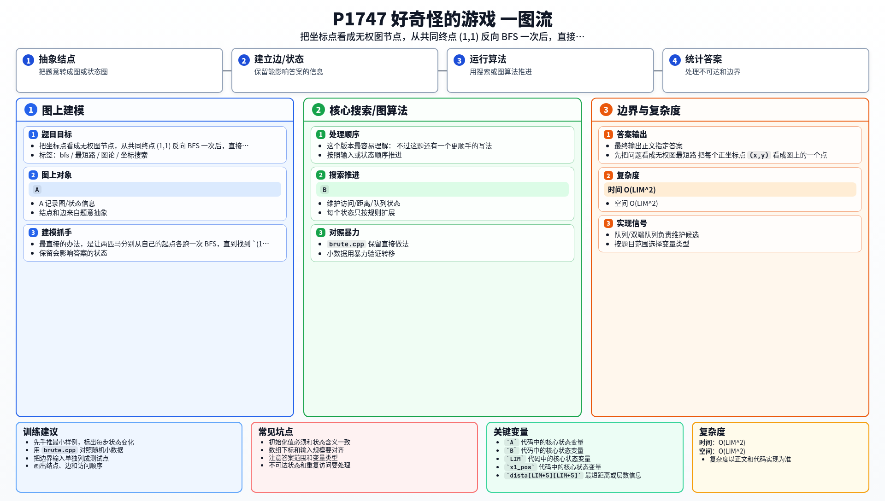

[[TOC]]

### 题意

有两匹马，分别在 `(x1,y1)` 和 `(x2,y2)`。

它们都要走到 `(1,1)`。

这题里的马有两类走法：

1. 普通马的“日”字走法；
2. 还可以走“田”，也就是对角线方向移动两格。

并且只能待在 `x > 0` 且 `y > 0` 的位置。

要求输出这两匹马分别到 `(1,1)` 的最少步数。

### 思路

最直接的办法，是让两匹马分别从自己的起点各跑一次 BFS，直到找到 `(1,1)`。

这个版本最容易理解：

@include-code(./brute.cpp, cpp)

不过这题还有一个更顺手的写法。

#### 先把问题看成无权图最短路

把每个正坐标点 `(x,y)` 看成图上的一个点。

如果一步能从点 `A` 走到点 `B`，就在它们之间连一条长度为 `1` 的边。

由于每一步代价都相同，所以这是标准的无权图最短路问题，BFS 就足够了。

#### 为什么可以反着搜

两匹马的终点都是 `(1,1)`。

而且这张图是无向图，因为：

- 如果从 `(a,b)` 能一步走到 `(c,d)`，
- 那么从 `(c,d)` 也能一步走回 `(a,b)`。

所以：

- 从起点到 `(1,1)` 的最短路
- 等于从 `(1,1)` 到起点的最短路

这样我们就不必跑两次搜索了，直接从 `(1,1)` 做一次 BFS，把所有点到它的最短距离一次性预处理出来。

之后两匹马的答案都只是查数组。

#### 一共有 12 种转移

普通马有 8 种走法：

- `(+1,+2)`, `(+2,+1)`, ...

再加上“田”字的 4 种走法：

- `(+2,+2)`, `(+2,-2)`, `(-2,+2)`, `(-2,-2)`

总共是 12 个方向。

### 代码

@include-code(./main.cpp, cpp)

### 复杂度

- 时间复杂度：`O(LIM^2)`
- 空间复杂度：`O(LIM^2)`

这里 `LIM` 是覆盖题目范围的一个很小的常数上界。

### 总结

这题本质仍然是 BFS。

真正值得注意的点有两个：

1. 走法不只是普通马的 8 种，还多了 4 种“田”；
2. 两个起点有同一个终点，所以可以从终点反向 BFS 一次，直接回答两次询问。

### 一图流解析

这张图把本题的建模、关键转移、实现检查和训练方法压缩到一页，适合读完正文后复盘。

