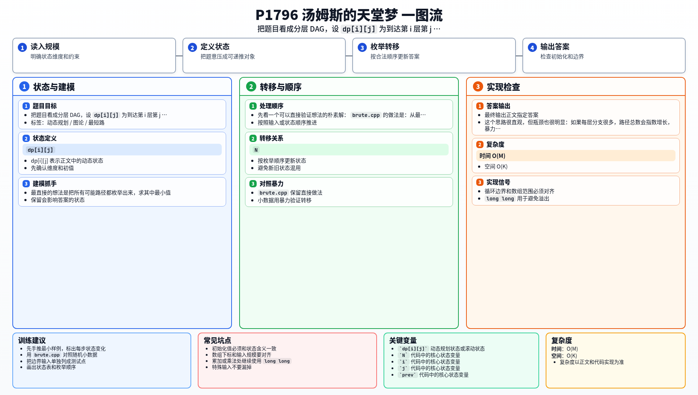

[[TOC]]

### 题意

第 `0` 层只有一个起点星球。

之后一共有 `N` 层，每层有若干个星球。题目按层给出所有航线信息：当前层某个星球可以由上一层哪些星球飞来，以及每条航线的费用。

费用可能是正数，也可能是负数。要求从第 `0` 层出发，到达第 `N` 层任意一个星球，使总花费最小。

### 思路

最直接的想法是把所有可能路径都枚举出来，求其中最小值。

先看一个可以直接验证想法的朴素解：

@include-code(./brute.cpp, cpp)

`brute.cpp` 的做法是：从最后一层某个星球出发，递归枚举它来自上一层哪些前驱，再一直追溯到第 `0` 层。

这个思路很直观，但瓶颈也很明显：如果每层分支很多，路径总数会指数增长，暴力只能做小数据。

关键观察是：图中的边只会从第 `i-1` 层连到第 `i` 层，所以整张图天然是 DAG。即使边权有负数，也不会有负环问题。

设 `dp[i][j]` 表示到达第 `i` 层第 `j` 个星球的最小花费，那么只需要看它所有上一层前驱：

`dp[i][j] = min(dp[i-1][from] + cost)`

也就是说，一个点的答案完全由上一层决定，直接按层转移即可。

#### 样例转移表

这张表展示样例中每个星球的最小花费是怎样一层一层算出来的：

| 层数 | 星球 | 可选转移 | 最小花费 |
| --- | --- | --- | --- |
| 1 | 1 | `起点 +15` | `15` |
| 1 | 2 | `起点 +5` | `5` |
| 2 | 1 | `15-5`, `5+10` | `10` |
| 2 | 2 | `15+3` | `18` |
| 2 | 3 | `5+40` | `45` |
| 3 | 1 | `10+1`, `18+5`, `45-5` | `11` |
| 3 | 2 | `18-19`, `45-20` | `-1` |

从这张表可以看到，每个状态只依赖上一层已经求出的状态，所以按层 DP 就够了。
最后一层有多个星球时，再统一取最小值，就是最终答案。

实现时还可以压缩掉第一维，只保留：

- `prev`：上一层最优值
- `cur`：当前层最优值

这样一边读输入一边转移，代码会更直接。

#### 数组写法参考

如果想贴近传统 OI 写法，可以先看这个二维数组版本。它把每个星球的所有前驱先存下来，再统一按层转移。

#### DP 公式

设 $dp_{i,j}$ 表示到达第 $i$ 层第 $j$ 个星球的最小花费。第 $0$ 层只有虚拟起点：

$$
dp_{0,1}=0
$$

如果第 $i$ 层星球 $j$ 可以从上一层星球 $from$ 到达，费用为 $cost(from,j)$，则：

$$
dp_{i,j}=\min_{from}\{dp_{i-1,from}+cost(from,j)\}
$$

最后答案为最后一层所有星球中的最小值：

$$
\min_j dp_{n,j}
$$

@include-code(./rainboy.cpp, cpp)

公式解释：图按层展开后，当前层的星球只会从上一层星球到达。`dp_{i,j}` 枚举所有能连到它的上一层前驱，把前驱最小花费加上边费用取最小，就得到到达这个星球的最小花费。

### 代码

正式提交时可以使用下面这个版本。它一边读入一边转移，只保留上一层和当前层的最小花费。

@include-code(./main.cpp, cpp)

### 复杂度

设所有航线总数为 `M`。

- 时间复杂度：`O(M)`
- 空间复杂度：`O(K)`，其中 `K` 是单层最大星球数

### 总结

这题的核心不是负边，而是“分层且只往下一层走”这个结构。

一旦看出它是一张分层 DAG，问题就变成了最普通的按层动态规划：每个点从上一层所有前驱里取最小转移即可。

### 一图流解析

这张图把本题的建模、关键转移、实现检查和训练方法压缩到一页，适合读完正文后复盘。

