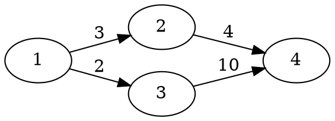
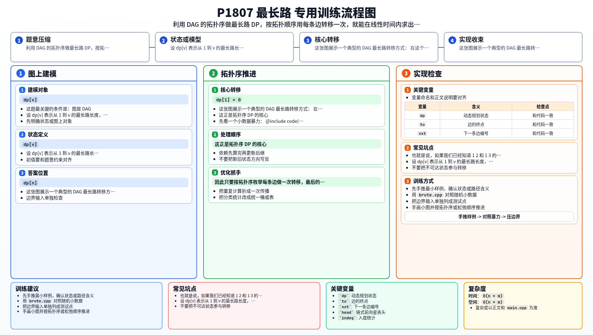

[[TOC]]

### 题意

给定一个带权有向无环图，求从点 `1` 到点 `n` 的最长路长度。

如果 `1` 无法到达 `n`，输出 `-1`。

### 思路

#### 样例图

这张图展示一个典型的 DAG 最长路转移方式：

在这个图里，点 `4` 的答案要从所有前驱里取最大值。
也就是说，如果我们已经知道 `1 -> 2` 和 `1 -> 3` 的最长路，那么就能继续推出 `1 -> 4` 的最长路。
这正是拓扑序 DP 的核心。

先看一个小数据暴力：

@include-code(./brute.cpp, cpp)

暴力做法直接 DFS 枚举从 `1` 到 `n` 的所有路径。因为图是 DAG，它是正确的，但路径数可能很多，正式数据会超时。

这题最关键的条件是：图是 DAG。

既然没有环，我们就可以先做拓扑排序。设 `dp[v]` 表示从 `1` 到 `v` 的最长路长度，那么：

- `dp[1] = 0`
- 其它点初始化为负无穷，表示暂时不可达
- 若存在边 `u -> v`，则可以尝试用 `dp[u] + w` 更新 `dp[v]`

为什么可以这样做？

因为在拓扑序里，所有指向 `v` 的前驱都一定排在 `v` 前面。所以当我们处理到 `v` 时，所有可能更新它的点都已经处理完了，`dp[v]` 就已经是最终值。

因此只要按拓扑序枚举每条边做一次转移，最后的 `dp[n]` 就是答案。

### 代码

@include-code(./main.cpp, cpp)

### 复杂度

时间复杂度 `O(n + m)`，空间复杂度 `O(n + m)`。

### 总结

在一般有向图里，最长路很难做；但在 DAG 里，拓扑序天然给出了依赖顺序。抓住这一点，把“枚举所有路径”改成“对每条边做一次 DP 转移”，问题就变成了模板题。

### 一图流解析

这张图把本题的建模、关键转移、实现检查和训练方法压缩到一页，适合读完正文后复盘。

