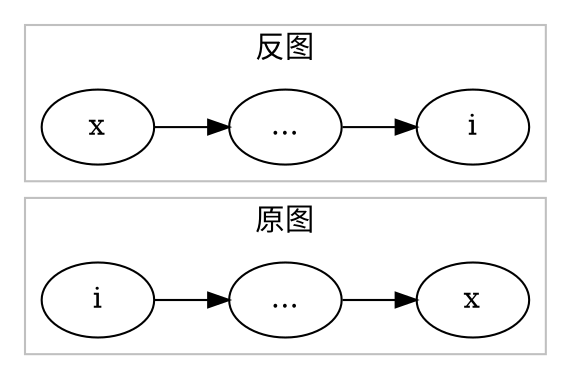
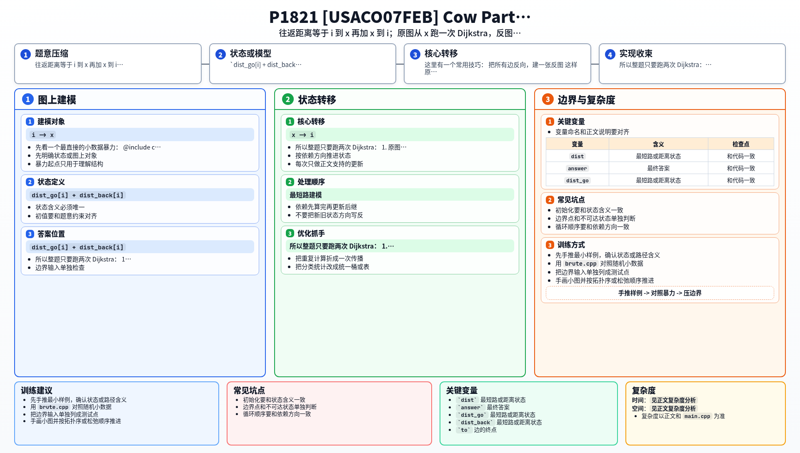

[[TOC]]

### 题意

有 `n` 头牛都要去编号为 `x` 的农场参加派对。  
图是有向图，每条边有长度。

每头牛都要：

1. 从自己家走到 `x`
2. 参加完派对后再从 `x` 走回自己家

两段都走最短路。  
要求所有牛的“往返最短路长度”里的最大值。

#### 反图直觉图

这张图展示了为什么“求 `i -> x`”可以改成“在反图里求 `x -> i`”：

原图里从 `i` 走到 `x` 的一条路径，边全部反过来后，就变成反图里从 `x` 走到 `i` 的路径。

### 思路

先看一个最直接的小数据暴力：

@include-code(./brute.cpp, cpp)

暴力做法可以用 Floyd：

1. 先求任意两点最短路
2. 对每个点 `i` 计算 `dist[i][x] + dist[x][i]`
3. 取最大值

但这题真正的关键不是 Floyd，而是把“去程”和“回程”拆开。

对于每头牛 `i`：

- 去派对：`i -> x`
- 回家：`x -> i`

回家这一段很简单，直接在原图上从 `x` 跑一次 Dijkstra，就能得到所有 `x -> i` 的最短路。

难点是去派对这一段：我们想要的是所有 `i -> x`。

这里有一个常用技巧：

- 把所有边反向，建一张反图

这样原图里：

- `i -> ... -> x`

就会变成反图里：

- `x -> ... -> i`

于是“所有点到 `x` 的最短路”，就变成了“反图里从 `x` 出发的单源最短路”。

所以整题只要跑两次 Dijkstra：

1. 原图从 `x` 出发，得到 `x -> i`
2. 反图从 `x` 出发，得到 `i -> x`

最后枚举每个点 `i`：

- `dist_go[i] + dist_back[i]`

取最大值即可。

### 代码

@include-code(./main.cpp, cpp)

### 复杂度

两次堆优化 Dijkstra：

- `O((N + M) log N)`

最后扫一遍所有点：

- `O(N)`

总复杂度：

- `O((N + M) log N)`

空间复杂度：

- `O(N + M)`

### 总结

这题最值得记住的是反图这个转换：

- 求“所有点到某个固定点”的最短路
- 可以改成“反图里从这个固定点出发”的单源最短路

所以本题本质上是：

1. 原图一次 Dijkstra
2. 反图一次 Dijkstra
3. 合并去程和回程答案

### 一图流解析

这张图把本题的建模、关键转移、实现检查和训练方法压缩到一页，适合读完正文后复盘。

