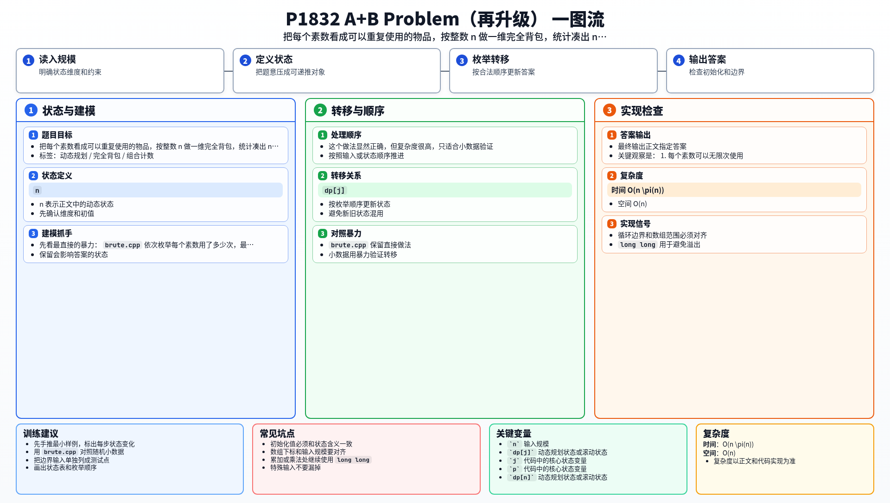

[[TOC]]

### 题意

给定一个正整数 `n`，求把它分解成若干个素数之和的方案总数。

这里“方案总数”指的是组合数，不是排列数。

例如 `7` 的方案有：

- `7`
- `2 + 5`
- `2 + 2 + 3`

所以答案是 `3`。

这张表把题目翻译成了背包模型：

| 原题对象 | 背包含义 |
| --- | --- |
| 一个素数 | 一个可以重复使用的物品 |
| 选择一个素数 | 目标和增加这个素数 |
| 目标 | 凑出总和 `n` |
| 评价标准 | 方案数累计 |

从这里可以看出，本题是“组合计数版”的完全背包。

### 思路

先看最直接的暴力：

@include-code(./brute.cpp, cpp)

`brute.cpp` 依次枚举每个素数用了多少次，最后看能不能刚好凑出 `n`。

这个做法显然正确，但复杂度很高，只适合小数据验证。

关键观察是：

1. 每个素数可以无限次使用。
2. 我们统计的是“组合数”，不是“排列数”。

所以设：

- `dp[j]` 表示凑出 `j` 的组合方案数

这张表说明状态定义：

| 状态 | 含义 |
| --- | --- |
| `dp[j]` | 凑出 `j` 的组合方案数 |

初始化时：

- `dp[0] = 1`

表示凑出 `0` 有一种方法：什么都不选。

处理一个素数 `p` 时，完全背包正序枚举：

- `dp[j] += dp[j - p]`

这里正序枚举会让同一种素数在本轮继续参与转移，符合“可以重复使用”的要求。

同时因为外层是素数，内层是容量，所以同一个组合只会按固定顺序统计一次，不会把 `2+5` 和 `5+2` 当成两个方案。

最后输出 `dp[n]` 即可。

#### DP 公式

设 $dp_j$ 表示凑出 $j$ 的组合方案数。初始化：

$$
dp_0=1
$$

对每个素数 $p$ 做完全背包计数：

$$
dp_j\leftarrow dp_j+dp_{j-p}
$$

其中 $j\ge p$ 且容量正序枚举。最终答案为：

$$
dp_n
$$

公式解释：外层枚举素数，内层正序枚举和，可以保证统计的是组合而不是排列。`dp_{j-p}` 的每种方案加上一个素数 `p`，都会变成凑出 `j` 的方案。

### 代码

@include-code(./main.cpp, cpp)

### 复杂度

- 时间复杂度：`O(n \pi(n))`
- 空间复杂度：`O(n)`

### 总结

这题是完全背包的计数版本：

- 每个素数可以重复选
- 统计的是组合数，不是排列数
- 状态转移是累加方案数

以后看到“无限次选取 + 统计方案数”这类条件时，就可以优先往完全背包上想。

### 一图流解析

这张图把本题的建模、关键转移、实现检查和训练方法压缩到一页，适合读完正文后复盘。

