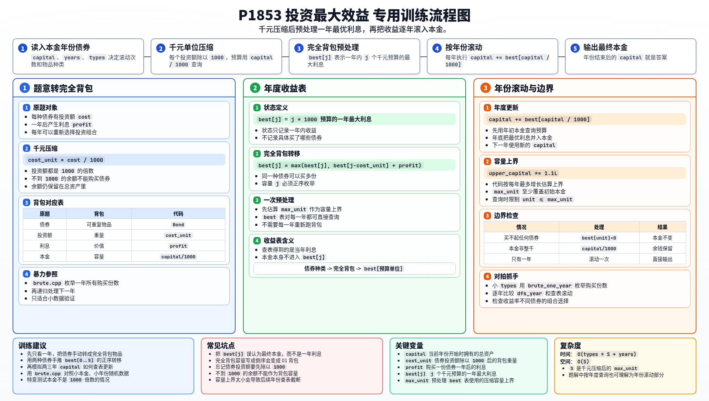

[[TOC]]

### 题意

有一笔初始资金，每一年都可以把钱投到若干种债券里。

每种债券都有：

- 投资额 `a`
- 一年的利息 `b`

因为投资额都是 `1000` 的倍数，所以一年的投资方案只和“有多少个 1000 元”有关。
每年结束后，利息会并入总资产，下一年可以重新调整投资组合。

这张表把题意翻成了背包模型：

| 原题对象 | 背包含义 |
| --- | --- |
| 一种债券 | 一个可以重复使用的物品 |
| 投资额 `a` | 物品重量 |
| 年利息 `b` | 物品价值 |
| 一年的总资金 | 背包容量 |

### 思路

#### 一图流解析

这张图把本题的建模、关键转移、实现检查和训练方法压缩到一页，适合先建立整体框架。

先看最直接的暴力：

@include-code(./brute.cpp, cpp)

`brute.cpp` 先枚举某一年所有可行的投资组合，再把这个过程按年份递归下去。

这个做法正确，但复杂度很高，只适合小数据验证。

关键观察是：

1. 这一年的最优投资方案只和当前资金有关。
2. 债券投资额都是 `1000` 的倍数，所以可以把资金按 `1000` 元一档压缩。
3. 每年都要重新做一次“预算内收益最大化”，这正是完全背包。

于是先定义：

- `best[j]` 表示有 `j` 个 `1000` 元预算时，这一年最多能拿到多少利息

这张表说明状态定义：

| 状态 | 含义 |
| --- | --- |
| `best[j]` | 一年内预算为 `j * 1000` 时的最大利息 |

对于每种债券：

- 它可以买很多份，所以是完全背包
- 转移是 `best[j] = max(best[j], best[j - cost] + profit)`

#### DP 公式

每一年都做一次完全背包。设 $best_j$ 表示这一年本金不超过 $j$ 时能获得的最大收益。对每种债券，成本为 $cost_i$，收益为 $profit_i$：

$$
best_j=\max(best_j,\ best_{j-cost_i}+profit_i)
$$

容量正序枚举。若第 $y$ 年开始时本金为 $money_y$，则年底本金变为：

$$
money_{y+1}=money_y+best_{money_y}
$$

每年结算时：

- 用当前总资产 `capital` 的千元部分 `capital / 1000`
- 查出这一年的最优利息 `best[...]`
- 把利息加回总资产，进入下一年

公式解释：每年本金固定后，都要在这个预算内选择债券组合使收益最大。债券可以买多份，所以用完全背包算出当年最大收益，再把收益滚入下一年的本金。

### 代码

@include-code(./main.cpp, cpp)

### 复杂度

- 时间复杂度：`O(n * S + d * S)`，其中 `S` 是按 `1000` 压缩后的资金上界
- 空间复杂度：`O(S)`

### 总结

这题可以拆成两层：

1. 先把“一年内怎么投最赚”做成完全背包
2. 再把这一年的最优收益按年份滚动叠加

真正起作用的是“预算按千元压缩”这个观察，它让每年的最优收益表可以直接复用。
