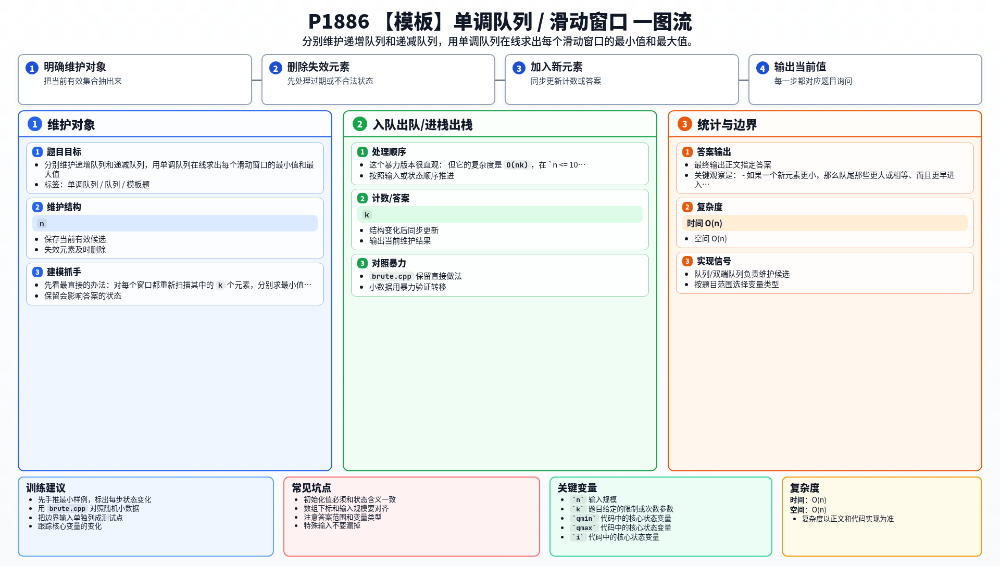

[[TOC]]

### 题意

给定一个长度为 `n` 的序列和窗口大小 `k`。

窗口从左向右每次移动一格，要求输出：

- 每个窗口的最小值
- 每个窗口的最大值

### 思路

先看最直接的办法：对每个窗口都重新扫描其中的 `k` 个元素，分别求最小值和最大值。

这个暴力版本很直观：

@include-code(./brute.cpp, cpp)

但它的复杂度是 `O(nk)`，在 `n <= 10^6` 时肯定过不去。

这题的关键观察是：

- 如果一个新元素更小，那么队尾那些更大或相等、而且更早进入窗口的元素，以后都不可能再成为最小值；
- 如果一个新元素更大，那么队尾那些更小或相等、而且更早进入窗口的元素，以后都不可能再成为最大值。

所以我们可以分别维护两个存“下标”的单调队列：

- `qmin`：值递增，队头是当前窗口最小值下标；
- `qmax`：值递减，队头是当前窗口最大值下标。

每次处理位置 `i` 时：

1. 先把所有已经不在窗口中的下标从队头删掉；
2. 再从队尾删掉所有不可能成为未来答案的候选；
3. 把当前下标 `i` 入队；
4. 当 `i >= k` 时，队头就是当前窗口答案。

如果你想看更系统的基础讲解，可以参考 rbook 里的《单调队列》：
<https://rbook2.roj.ac.cn/data_structure/monotonic_queue/index.html>

### 代码

@include-code(./main.cpp, cpp)

### 复杂度

- 时间复杂度：`O(n)`
- 空间复杂度：`O(n)`

### 总结

单调队列的本质是：只保留窗口里还有机会成为答案的候选。

这道题是最标准的单调队列模板题，关键规则只有两条：

- 过期的从队头删；
- 更差的从队尾删。

### 一图流解析

这张图把本题的建模、关键转移、实现检查和训练方法压缩到一页，适合读完正文后复盘。

