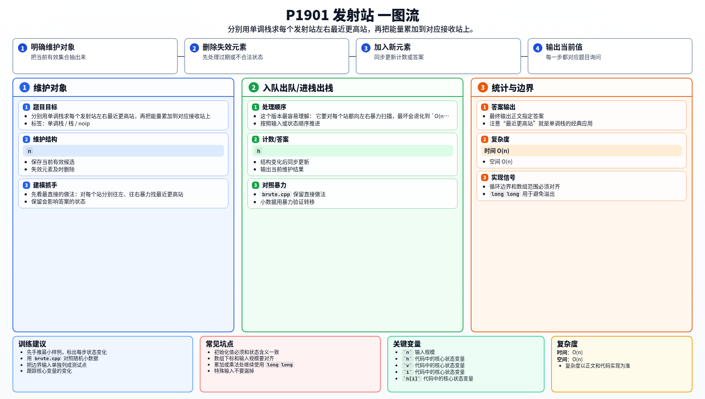

[[TOC]]

### 题意

给出 `n` 个排成一行的发射站，每个站有互不相同的高度 `h` 和能量 `v`。

每个站的能量会分别传给左右两边“最近的更高站”。

要求统计所有站接收到的总能量，输出其中最大值。

### 思路

先看最直接的做法：对每个站分别往左、往右暴力找最近更高站。

这个版本最容易理解：

@include-code(./brute.cpp, cpp)

它要对每个站都向左右暴力扫描，最坏会退化到 `O(n^2)`，显然不能处理 `n=10^6`。

注意“最近更高站”就是单调栈的经典应用。

### 左边最近更高站

从左到右扫描，栈里维护高度严格递减的站编号。

处理站 `i` 时：

1. 先把栈顶所有高度小于 `h[i]` 的站弹掉；
2. 如果栈不空，栈顶就是 `i` 左边最近的更高站；
3. 把 `i` 入栈。

### 右边最近更高站

再从右到左做一遍完全对称的扫描，就能找到右边最近更高站。

这样每个站只会进栈、出栈各一次。两次扫描结束后，把每个站的能量加到左右两个接收站上，最后在所有接收值中取最大值即可。

### 代码

@include-code(./main.cpp, cpp)

### 复杂度

- 时间复杂度：`O(n)`
- 空间复杂度：`O(n)`

### 总结

这题的关键是把“左右最近更高站”识别成单调栈模型。

每个站只会被弹出一次，所以整套流程是线性的。

### 一图流解析

这张图把本题的建模、关键转移、实现检查和训练方法压缩到一页，适合读完正文后复盘。

