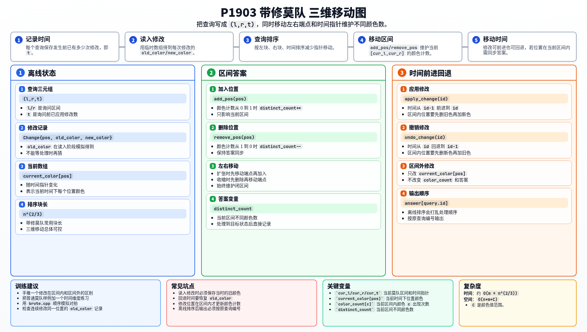

[[TOC]]

### 题意

维护一个颜色序列，支持两类操作：

- `Q L R`：查询 `[L,R]` 中有多少种不同颜色；
- `R P C`：把位置 `P` 的颜色改成 `C`。

### 思路

朴素做法是按顺序执行操作，查询时扫描整个区间统计颜色。

先看一个可以直接验证想法的朴素解：

@include-code(./brute.cpp, cpp)

有修改操作后，普通莫队只移动左右端点还不够。我们给每个查询多记录一个维度 `t`：这个查询发生前已经执行了多少次修改。

于是一个查询可以表示为 `(l, r, t)`。处理它时需要让当前状态满足：

- 当前区间是 `[l,r]`；
- 当前数组已经应用了前 `t` 次修改。

读入修改时，要记录这次修改的 `pos`、`old_color`、`new_color`。其中 `old_color` 不能等到处理时再猜，必须在读入阶段用临时数组模拟修改得到。

调整时间时：

- 时间前进：应用下一次修改；
- 时间回退：撤销当前最后一次修改；
- 如果修改位置在当前区间内，就先从答案中删掉旧颜色，再加入新颜色。

当前区间的不同颜色数用 `color_count` 和 `distinct_count` 维护。加入一个位置时，如果这个颜色原来次数为 `0`，不同颜色数加一；删除时如果次数变成 `0`，不同颜色数减一。

### 代码

@include-code(./main.cpp, cpp)

### 复杂度

带修莫队常用块长 `n^(2/3)`，总复杂度约为 `O(m * n^(2/3))` 量级。

空间复杂度 `O(n+m+C)`，`C` 是颜色值范围。

### 总结

带修莫队比普通莫队多了一个“时间指针”。只要修改能正确前进和回退，区间答案仍然可以像普通莫队一样用 add/remove 维护。

### 一图流解析

这张图把本题的建模、关键转移、实现检查和训练方法压缩到一页，适合读完正文后复盘。

