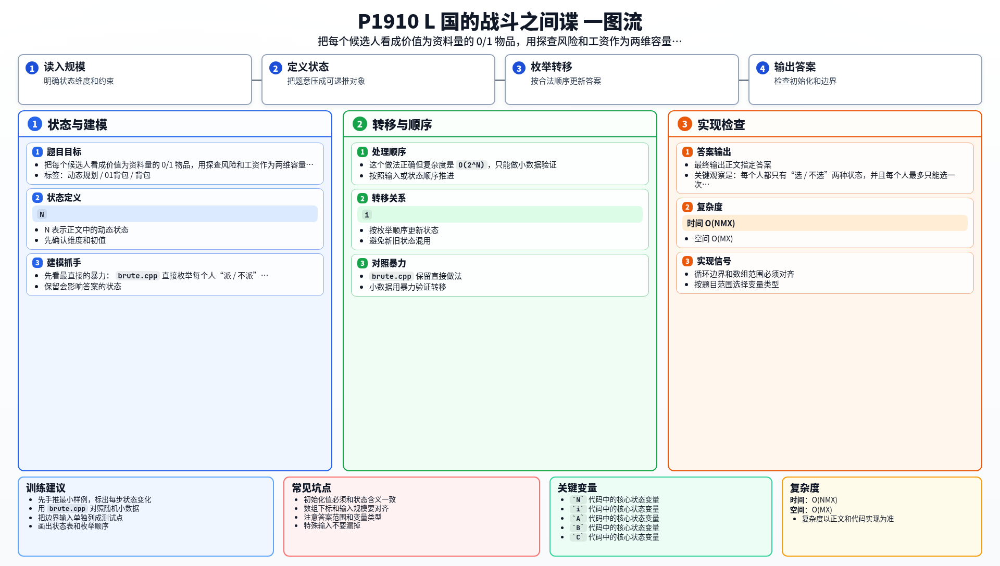

[[TOC]]

### 题意

有 `N` 个候选间谍。

第 `i` 个人有三项属性：

- `A`：能得到多少资料
- `B`：伪装能力有多差，也就是会增加多少探查风险
- `C`：需要多少工资

敌人的探查能力上限是 `M`，手里的钱数上限是 `X`。要求在总风险和总工资都不超限的前提下，让拿到的资料总量最大。

### 思路

先看最直接的暴力：

@include-code(./brute.cpp, cpp)

`brute.cpp` 直接枚举每个人“派 / 不派”，最后检查总风险和总工资是否超限。

这个做法正确但复杂度是 `O(2^N)`，只能做小数据验证。

关键观察是：每个人都只有“选 / 不选”两种状态，并且每个人最多只能选一次，所以本质上是 0/1 背包。

不过这题同时有两种限制：

- 总探查风险不能超过 `M`
- 总工资不能超过 `X`

因此它不是普通一维背包，而是二维费用 0/1 背包。

设：

- `dp[j][k]` 表示总风险不超过 `j`、总工资不超过 `k` 时，最多能拿到多少资料

加入一个人 `(A_i, B_i, C_i)` 时：

- 不选他：状态不变
- 选他：从 `dp[j - B_i][k - C_i]` 转移，再加上 `A_i`

所以有转移：

- `dp[j][k] = max(dp[j][k], dp[j - B_i][k - C_i] + A_i)`

由于每个人只能选一次，两维容量都必须倒序枚举。

#### 状态表

这张表说明状态的含义：

| 状态 | 含义 |
| --- | --- |
| `dp[j][k]` | 总风险不超过 `j`、总工资不超过 `k` 时，最多能拿到多少资料 |

这个定义说明，我们只关心在给定资源限制下的最优资料量，不需要记录具体选了哪些人。
因此用一张二维表就能完整表达状态。

最后输出 `dp[M][X]` 即可。

#### DP 公式

设 $dp_{j,k}$ 表示总风险不超过 $j$、总工资不超过 $k$ 时，最多能拿到多少资料。处理第 $i$ 个人时：

$$
dp_{j,k}=\max(dp_{j,k},\ dp_{j-B_i,k-C_i}+A_i)
$$

其中 $j\ge B_i$ 且 $k\ge C_i$。由于每个人只能选一次，两维容量都倒序枚举。最终答案为：

$$
dp_{M,X}
$$

公式解释：每个间谍只能招募一次，所以是二维 0/1 背包。风险和工资是两个容量，资料量是收益；只有两个容量都足够时，才能考虑选这个人。

### 代码

@include-code(./main.cpp, cpp)

### 复杂度

- 时间复杂度：`O(NMX)`
- 空间复杂度：`O(MX)`

### 总结

看到下面这种结构时，就应该往二维费用背包上想：

- 每个对象最多选一次
- 同时消耗两种资源
- 目标是最大化总价值

这题里“价值”就是资料量，因此直接套二维费用 0/1 背包模板即可。

### 一图流解析

这张图把本题的建模、关键转移、实现检查和训练方法压缩到一页，适合读完正文后复盘。

