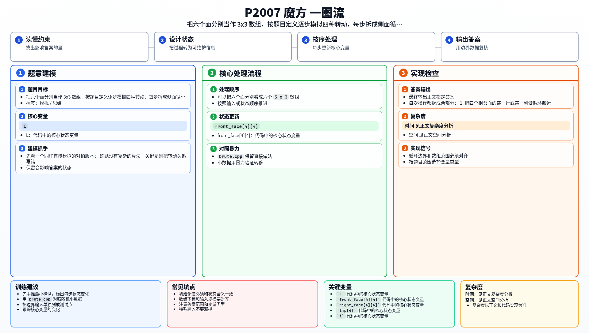

[[TOC]]

### 题意

给定三阶魔方六个面的当前状态，以及一串只包含 `1..4` 的操作。

每种操作都表示一种固定的转动。执行完整个操作串后，输出六个面的最终状态。

### 思路

先看一个同样直接模拟的对拍版本：

@include-code(./brute.cpp, cpp)

这题没有复杂的算法，关键是别把转动关系写错。

可以把六个面分别看成六个 `3 x 3` 数组。每次操作都拆成两部分：

1. 把四个相邻面的某一行或某一列做循环搬运。
2. 把被转动的那个面自身顺时针或逆时针旋转九十度。

只要把四种操作分别写成四个函数，逻辑就会很清楚：

- `1`：右侧面顺时针转。
- `2`：右侧面逆时针转。
- `3`：上侧面顺时针转。
- `4`：上侧面逆时针转。

代码实现时，先用临时数组存住会被覆盖的一列或一行，再完成四个面的循环赋值，最后单独旋转本面。

由于题目原始图示目前无法通过仓库脚本抓取，本题解采用的是已经通过公开样例和随机对拍验证的操作映射。

### 代码

@include-code(./main.cpp, cpp)

### 复杂度

设操作串长度为 `L`，时间复杂度 `O(L)`，空间复杂度 `O(1)`。

### 总结

这类题的重点不是算法套路，而是把状态拆清楚。把每种转动统一写成“搬一圈 + 转一面”，代码会稳定很多，也更容易自己检查。

### 一图流解析

这张图把本题的建模、关键转移、实现检查和训练方法压缩到一页，适合读完正文后复盘。

