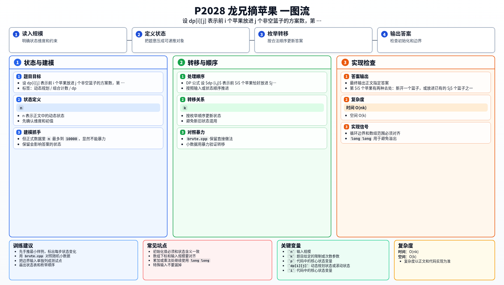

[[TOC]]

### 题意

有 `n` 个互不相同的苹果和 `k` 个篮子。

要求把所有苹果放进篮子里，并且每个篮子都不能为空。问一共有多少种放法，最后输出答案对 `p` 取模后的结果。

### 思路

先看一个最朴素的理解方式：

@include-code(./brute.cpp, cpp)

`brute.cpp` 按苹果编号从小到大 DFS：

- 当前苹果放进某个已经开的篮子
- 或者开一个新篮子给它

这样可以完整枚举所有方案，适合作为小数据对拍程序。

但正式数据里 `n` 最多到 `10000`，显然不能暴力。

设：

- `dp[i][j]` 表示前 `i` 个苹果恰好放进 `j` 个非空篮子的方案数

考虑第 `i` 个苹果，有两种放法：

1. **单独开一个新篮子**  
   那前 `i-1` 个苹果必须已经放成 `j-1` 个非空篮子  
   贡献：`dp[i-1][j-1]`

2. **放进已有的某个旧篮子**  
   前 `i-1` 个苹果已经放成 `j` 个非空篮子  
   现在有 `j` 个旧篮子可选  
   贡献：`j * dp[i-1][j]`

所以转移式就是：

`dp[i][j] = dp[i-1][j-1] + j * dp[i-1][j]`

#### 样例转移表

以样例 `n = 4, k = 2` 为例，部分状态如下：

| `i \\ j` | 0 | 1 | 2 |
| --- | --- | --- | --- |
| 0 | 1 | 0 | 0 |
| 1 | 0 | 1 | 0 |
| 2 | 0 | 1 | 1 |
| 3 | 0 | 1 | 3 |
| 4 | 0 | 1 | 7 |

最后 `dp[4][2] = 7`，对 `3` 取模后得到 `1`。

#### DP 公式

设 $dp_{i,j}$ 表示前 $i$ 个苹果恰好放进 $j$ 个非空篮子的方案数。第 $i$ 个苹果有两种去处：新开一个篮子，或放进已有的 $j$ 个篮子之一。因此：

$$
dp_{i,j}=dp_{i-1,j-1}+j\cdot dp_{i-1,j}
$$

边界为：

$$
dp_{0,0}=1
$$

最终答案为：

$$
dp_{n,k}\bmod m
$$

因为每一层只依赖上一层，所以实现时可以用滚动数组把二维 DP 压成一维。

公式解释：放第 `i` 个苹果时，如果它单独开一个新篮子，就从 `dp_{i-1,j-1}` 来；如果放进已有篮子，则有 `j` 个篮子可选，所以贡献是 `j * dp_{i-1,j}`。

### 代码

@include-code(./main.cpp, cpp)

### 复杂度

- 时间复杂度：`O(nk)`
- 空间复杂度：`O(k)`

### 总结

这题的关键是按“最后加入的那个苹果”分类讨论。

只要看清楚它不是“开新篮子”，就是“进入已有篮子”，转移式就会自然写出来。这也是第二类斯特林数最经典的递推形式。

### 一图流解析

这张图把本题的建模、关键转移、实现检查和训练方法压缩到一页，适合读完正文后复盘。

