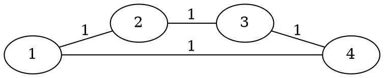

[[TOC]]

### 题意

给一张无向带权图，边权越小表示两个人关系越近。

对任意两点 `s, t`：

- `C[s][t]` 表示 `s -> t` 的最短路条数
- `C[s][t](v)` 表示经过点 `v` 的最短路条数

定义点 `v` 的重要程度为：

`I(v) = sum C[s][t](v) / C[s][t]`

其中要求：

- `s != v`
- `t != v`

题目要输出每个点的重要程度。

#### 样例图

这张图展示了为什么一个点的贡献可能只是“半条最短路”：

在这个四边形里，从 `2` 到 `4` 有两条等长最短路：  
`2-1-4` 和 `2-3-4`。  
因此点 `1` 对这对点的贡献不是 `1`，而是 `1/2`。

### 思路

先看一个最直接的小数据暴力：

@include-code(./brute.cpp, cpp)

暴力做法是：

1. 对每个源点 `s` 跑一次 Dijkstra
2. 求出 `s` 到所有点的最短距离和最短路条数
3. 再根据公式去累加每个点的贡献

这个思路已经很接近正解。  
而这题之所以能直接做，是因为 `N <= 100`，所以我们完全可以用 Floyd 统一处理所有点对。

关键有两层：

#### 1. Floyd 不只维护最短距离，还要维护最短路条数

如果经过中转点 `k` 以后更短：

- 用新的距离替换
- 最短路条数也改成 `cnt[i][k] * cnt[k][j]`

如果经过 `k` 以后一样短：

- 说明又找到了一批新的最短路
- 就把这批条数加到 `cnt[i][j]` 上

于是我们最后能得到：

- `dist[i][j]`：两点最短距离
- `cnt[i][j]`：两点最短路条数

#### 2. 什么时候点 `v` 会出现在 `s -> t` 的最短路上

只有当：

- `dist[s][v] + dist[v][t] == dist[s][t]`

时，`v` 才真的在某条最短路上。

这时，经过 `v` 的最短路条数就是：

- `cnt[s][v] * cnt[v][t]`

因为前半段和后半段可以自由拼接。

所以这对点对 `v` 的贡献就是：

- `cnt[s][v] * cnt[v][t] / cnt[s][t]`

把所有 `s, t` 累加起来，就是 `I(v)`。

### 代码

@include-code(./main.cpp, cpp)

### 复杂度

Floyd 三重循环：

- `O(N^3)`

最后枚举 `v, s, t` 统计贡献：

- `O(N^3)`

总复杂度：

- `O(N^3)`

空间复杂度：

- `O(N^2)`

### 总结

这题最核心的不是 Floyd 本身，而是两个判定：

1. 最短路条数怎么随着 Floyd 一起维护
2. 一个点什么时候真的在某对点的最短路上

只要记住：

- `dist[s][v] + dist[v][t] == dist[s][t]`
- `贡献 = cnt[s][v] * cnt[v][t] / cnt[s][t]`

整题就很顺了。

### 一图流解析

这张图把本题的建模、关键转移、实现检查和训练方法压缩到一页，适合读完正文后复盘。

