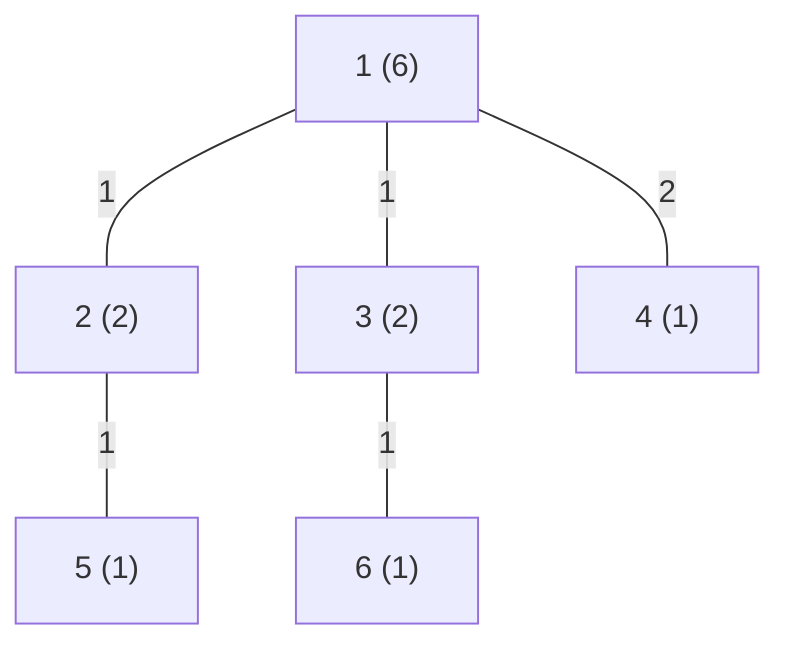

[[TOC]]

### 题意

给出一棵带权树。对每条边，如果删掉它后树被分成两部分，设两侧点数分别是 `a` 和 `b`，这条边的费用就是：

`边长 * |a - b|`

题目要求把所有边的费用加起来。

### 思路

最直接的办法是枚举每条边，把它删掉，然后暴力数一侧连通块大小。

先看一个可以直接验证想法的朴素解：

@include-code(./brute.cpp, cpp)

`brute.cpp` 对每条边都重新做一次 flood fill，能直接对应题意，但复杂度最坏是 `O(n^2)`，面对 `10^6` 规模显然不够。

关键观察是：把树任选一个点定根后，每条边的一侧其实就是某个儿子的整棵子树。

#### 样例树

这张图展示样例树的结构，括号里写的是以 `1` 为根时的子树大小：

例如边 `1-2` 的两侧点数分别是 `2` 和 `4`，贡献就是 `1 * |2 - 4| = 2`。
所以只要知道每条父子边下面那棵子树的大小，这条边的贡献就立刻确定了。
整题的难点，不是枚举边，而是如何一次性求出所有子树大小。

设某条父子边下面那棵子树大小是 `siz`，那么另一边大小就是 `n - siz`，于是这条边贡献可以写成：

`w * |siz - (n - siz)| = w * |n - 2 * siz|`

因此做法很自然：

1. 任选 `1` 为根
2. 用一次迭代 DFS 建立父子关系，并记录访问顺序
3. 再把访问顺序倒过来扫，回推每个点的子树大小
4. 对每个非根节点，用它的 `subtree_size` 统计父边贡献

这样所有边都只处理常数次，总复杂度就是线性的。

### 代码

@include-code(./main.cpp, cpp)

### 复杂度

建图、迭代 DFS、逆序统计子树大小都只需要 `O(n)`，所以总时间复杂度是 `O(n)`，空间复杂度也是 `O(n)`。

### 总结

这题的核心是把“删边后两侧点数”改写成“子树大小和剩余点数”。一旦看出每条边贡献只和子树大小有关，问题就转成了标准的树上统计。
