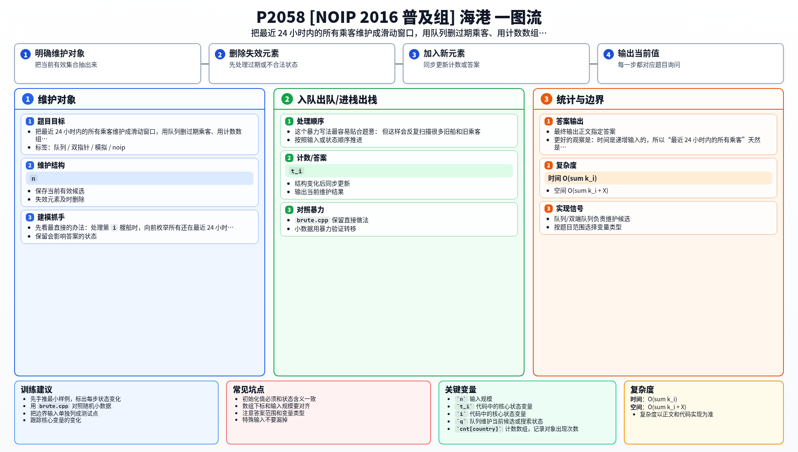

[[TOC]]

### 题意

按时间顺序给出 `n` 艘船到港的信息，每艘船有若干乘客，每个乘客有一个国籍编号。

对于每艘船到达时刻 `t_i`，需要统计满足：

- `t_i - 86400 < t_p <= t_i`

的所有船只上的所有乘客，一共来自多少个不同国家。

### 思路

先看最直接的办法：处理第 `i` 艘船时，向前枚举所有还在最近 24 小时内的船，再把这些船上的所有国籍丢进集合去重。

这个暴力写法最容易贴合题意：

@include-code(./brute.cpp, cpp)

但这样会反复扫描很多旧船和旧乘客。

更好的观察是：时间是递增输入的，所以“最近 24 小时内的所有乘客”天然是一个滑动窗口。

于是可以维护：

- 一个队列 `q`，保存当前窗口里的所有乘客 `(time, country)`；
- 一个计数数组 `cnt[country]`，表示这个国家当前在窗口里出现了多少次；
- 一个变量 `ans`，表示当前不同国家数。

处理新船 `(t, k, ...)` 时：

1. 先把所有 `time <= t - 86400` 的过期乘客从队头弹出；
2. 弹出时更新计数，若某国家计数变成 `0`，则 `ans--`；
3. 把当前船上的所有乘客加入队尾；
4. 若某国家计数从 `0` 变成 `1`，则 `ans++`；
5. 输出 `ans`。

### 代码

@include-code(./main.cpp, cpp)

### 复杂度

- 时间复杂度：`O(sum k_i)`
- 空间复杂度：`O(sum k_i + X)`，其中 `X` 是国籍编号上界

### 总结

这题的本质不是“每次重新统计最近一天”，而是“维护一个按时间滑动的乘客窗口”。

一旦把问题改写成滑动窗口，队列和计数数组就是最自然的组合。

### 一图流解析

这张图把本题的建模、关键转移、实现检查和训练方法压缩到一页，适合读完正文后复盘。

