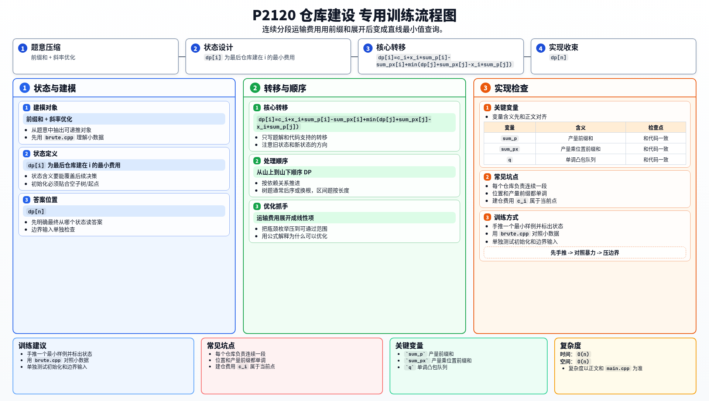

[[TOC]]

### 题意

每个工厂可以选择建仓库，也可以把货物往山下运到更低处的某个仓库。

总费用包含两部分：

- 建仓费用
- 按距离计算的运输费用

要求最小化总费用。

### 思路

先看朴素 DP：

@include-code(./brute.cpp, cpp)

设 `dp[i]` 表示前 `i` 个工厂全部处理完，并且最后一个仓库建在 `i` 的最小费用。

如果上一个仓库建在 `j`，那么 `j+1..i` 这些工厂的产品都运到 `i`。

利用前缀和：

- `sum_p[i] = p_1 + ... + p_i`
- `sum_px[i] = p_1x_1 + ... + p_ix_i`

则这一段的运输费用是：

`x_i (sum_p[i] - sum_p[j]) - (sum_px[i] - sum_px[j])`

于是：

`dp[i] = min(dp[j] + c_i + x_i(sum_p[i]-sum_p[j]) - (sum_px[i]-sum_px[j]))`

整理一下：

`dp[i] = c_i + x_i sum_p[i] - sum_px[i] + min(dp[j] + sum_px[j] - x_i sum_p[j])`

这就变成了标准斜率优化：

- 决策点 `j` 对应一条线
- 查询点是当前的 `x_i`

又因为：

- `x_i` 单调递增
- `sum_p[j]` 单调递增

所以可以直接用单调队列维护凸包。

#### DP 转移方程

核心状态：

`dp[i]` 为最后仓库建在 i 的最小费用

核心转移：

`dp[i]=c_i+x_i*sum_p[i]-sum_px[i]+min(dp[j]+sum_px[j]-x_i*sum_p[j])`

答案收束：

`dp[n]`

### 代码

@include-code(./main.cpp, cpp)

### 复杂度

时间复杂度 `O(n)`，空间复杂度 `O(n)`。

### 总结

这题的关键不是“建不建仓库”，而是看出：

每个仓库负责的一定是一段连续工厂。

一旦写成连续分段 DP，再把运输费用用前缀和展开，斜率优化就很自然了。

### 一图流解析

这张图把本题的建模、关键转移、实现检查和训练方法压缩到一页，适合读完正文后复盘。

