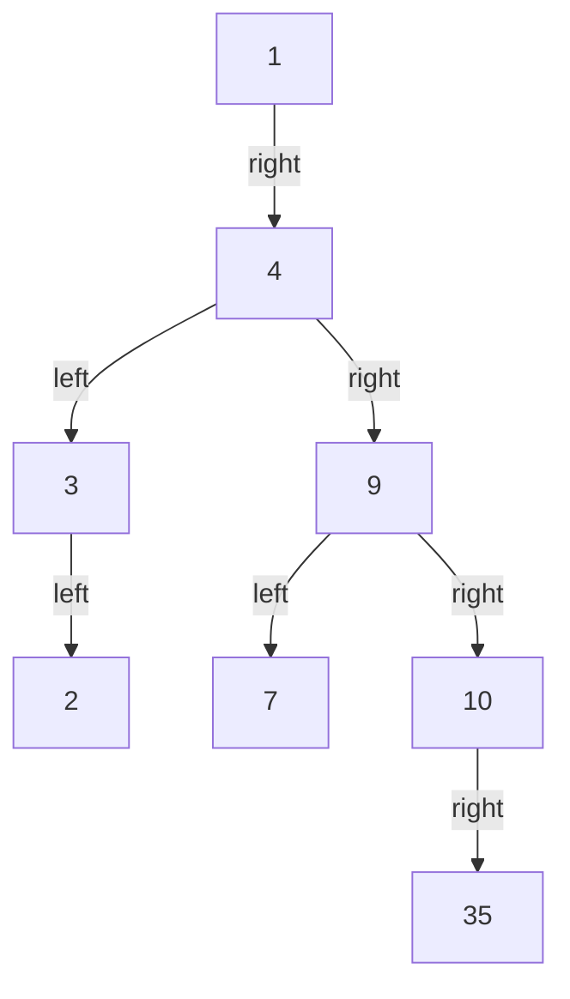

[[TOC]]

### 题意

给出 `n` 个互不相同的数，按顺序把它们插入一棵二叉查找树。

题目要求输出：

1. 这棵树的最大深度，格式为 `deep=...`
2. 这棵树的后序遍历

### 思路

最直接的办法是按题意真的模拟 BST 插入，然后 DFS 求答案。

先看一个可以直接验证想法的朴素解：

@include-code(./brute.cpp, cpp)

`brute.cpp` 显式建树后再递归输出后序遍历，适合帮助理解和对拍。但它最坏会退化成 `O(n^2)`，面对 `3e5` 的数据不够稳。

关键观察是：一个新值插入 BST 时，它的父亲只可能是当前已插入值中的前驱或后继。

#### 样例树

这张图展示样例插入完成后的 BST 结构：

从图里可以看到，样例的最大深度是 `5`。
后序遍历按“左、右、根”输出，所以答案正好是 `2 3 7 35 10 9 4 1`。
真正需要解决的问题，只剩下如何在线恢复这棵 BST 的父子关系。

维护一个有序集合保存已经插入的值：

- 用 `lower_bound` 找到当前值的后继
- 同时取前驱
- 这两个候选里，插入更晚的那个就是当前点的父亲

这样每次插入只需要一次有序集合查询，就能在 `O(log n)` 时间内确定父子关系。

树建好后，再用双栈做一次迭代后序遍历：

1. 第一栈负责遍历整棵树
2. 第二栈把访问顺序翻转成“左、右、根”

同时在连边时维护每个节点的深度，就能顺手得到最大深度。

### 代码

@include-code(./main.cpp, cpp)

### 复杂度

每次插入需要 `O(log n)` 找前驱和后继，后序遍历是 `O(n)`，所以总时间复杂度是 `O(n log n)`，空间复杂度是 `O(n)`。

### 总结

这题难点不在 BST 本身，而在看出“新点的父亲只可能是前驱或后继”。抓住这一点后，用有序集合在线找父亲，就能把最坏 `O(n^2)` 的插入过程优化到 `O(n log n)`。
