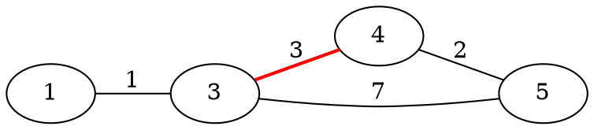
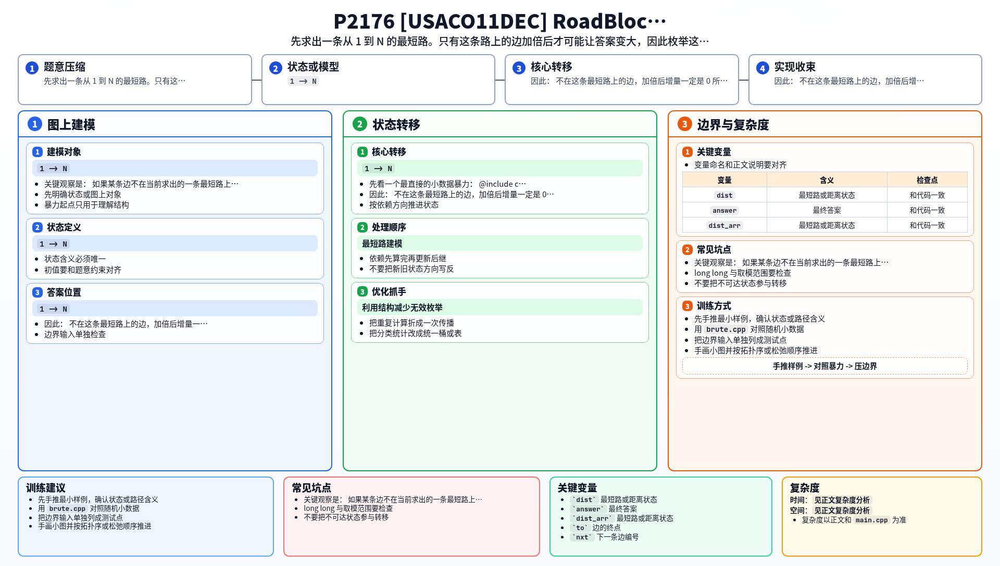

[[TOC]]

### 题意

有一张无向带权图，起点是 `1`，终点是 `N`。

现在可以选一条边，把它的长度加倍一次。  
要求让 `1 -> N` 的最短路长度增加得尽可能多，输出这个最大增量。

#### 样例直觉图

这张图展示了“把原最短路上的一条边加倍后，被迫改走别的路”的现象：

如果把红边 `3-4` 加倍，原来的最短路可能不再最优，答案就会变大。  
这说明我们真正关心的是：哪些边有能力把原最短路“挤掉”。

### 思路

先看一个最直接的小数据暴力：

@include-code(./brute.cpp, cpp)

暴力做法就是：

1. 枚举每一条边
2. 把它长度临时加倍
3. 重算 `1 -> N` 的最短路
4. 取增量最大值

这个做法最贴近题意，但对大图来说没必要把所有边都试一遍。

关键观察是：

- 如果某条边不在当前求出的一条最短路上
- 那么把它加倍之后，这条最短路本身仍然原封不动地存在

既然原来的这条最短路还在，新的最短路长度就不可能变大。  
而边长只会变大不会变小，所以新的最短路长度也不可能变小。  
因此：

- 不在这条最短路上的边，加倍后增量一定是 `0`

所以我们只需要：

1. 先求一遍 `1 -> N` 的最短路
2. 把这条最短路上的边重建出来
3. 只枚举这些边去加倍

于是主解流程变成：

1. 第一次 Dijkstra，求原最短路，并记录每个点的前驱边
2. 从 `N` 倒着回溯，得到一条完整最短路上的边编号
3. 对这条路上的每条边：
   - 临时把边权乘 `2`
   - 再跑一次 Dijkstra
   - 更新答案
   - 恢复边权

最后取所有增量里的最大值即可。

### 代码

@include-code(./main.cpp, cpp)

### 复杂度

设原最短路长度经过了 `L` 条边。

第一次求最短路：

- `O(M \log N)`

之后最多再重跑 `L` 次 Dijkstra，而 `L <= N-1`，所以总复杂度是：

- `O(N \cdot M \log N)`

在本题 `N <= 100, M <= 5000` 的范围内完全可行。

空间复杂度：

- `O(N + M)`

### 总结

这题最重要的不是 Dijkstra 本身，而是那个削减枚举范围的观察：

- 只有一条已知最短路上的边，才有资格让最短路变长

一旦把这一点想清楚，后面就只是：

- 路径重建
- 枚举边
- 重跑最短路

的直接实现。

### 一图流解析

这张图把本题的建模、关键转移、实现检查和训练方法压缩到一页，适合读完正文后复盘。

