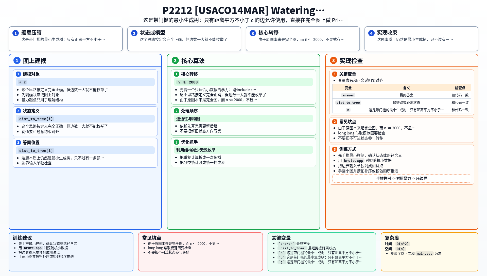

[[TOC]]

### 题意

给出 `n` 个点的坐标。

两点之间连边的代价定义为距离平方：

`(x_i-x_j)^2 + (y_i-y_j)^2`

但题目规定：如果这条边的代价小于 `c`，那么这条边根本不能用。

问在只允许使用代价不小于 `c` 的边时，能否把所有点连通；如果能，最小总代价是多少；如果不能，输出 `-1`。

### 思路

先看一个只适合小数据的暴力：

@include-code(./brute.cpp, cpp)

暴力直接把所有“允许使用”的边列出来，然后枚举哪些边能组成生成树，取总代价最小的那个。

这个思路按定义完全正确，但边数一大就不能枚举了。

这题本质上仍然是最小生成树，只不过有一条额外限制：

- 边权 `< c` 的边不能选

也就是说，我们是在一张“删掉非法边后的图”上求 MST。

由于原图本来是完全图，而 `n <= 2000`，不显式存下全部边会更省事，所以直接用 `Prim O(n^2)`：

1. 初始任选一个点加入生成树
2. `dist_to_tree[i]` 维护点 `i` 到当前生成树的最小合法边权
3. 每次选一个 `dist_to_tree` 最小的未访问点加入答案
4. 再用这个点去更新其它点的最优接入代价

如果某一轮最小的 `dist_to_tree` 仍然是无穷大，说明剩下点都无法通过合法边接到当前生成树上，答案就是 `-1`。

### 代码

@include-code(./main.cpp, cpp)

### 复杂度

设点数为 `n`。

Prim 每轮：

- 找一个最便宜接入的新点
- 再扫一遍所有点更新距离

所以：

- 时间复杂度 `O(n^2)`
- 空间复杂度 `O(n)`

### 总结

这题难点不在“距离平方”这个细节，而在先看出它仍然是 MST：只不过把边权小于 `c` 的边全部禁用了。识别成“带门槛的最小生成树”后，Prim 就能直接处理。

### 一图流解析

这张图把本题的建模、关键转移、实现检查和训练方法压缩到一页，适合读完正文后复盘。

