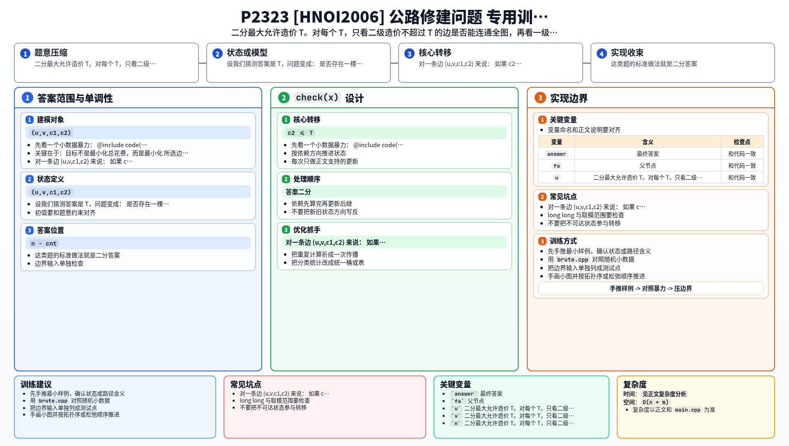

[[TOC]]

### 题意

有 `n` 个景点，候选公路一共若干条。

每条候选公路有两种修法：

- 一级公路，花费 `c1`
- 二级公路，花费 `c2`

并且 `c2 <= c1`。

你要选出 `n-1` 条公路把所有景点连起来，并且：

- 其中至少有 `k` 条是一级公路
- 所选公路里，花费最大的那一条尽量小

最后输出这个最小可能的“最大花费”，以及一组对应方案。

### 思路

先看一个小数据暴力：

@include-code(./brute.cpp, cpp)

暴力直接枚举生成树，再枚举每条边修一级还是二级：

- 只保留至少有 `k` 条一级公路的方案
- 计算这组方案里的最大边权
- 取最小值

这个思路按定义完全正确，但显然只适合很小数据。

关键在于：目标不是最小化总花费，而是最小化**所选边中的最大花费**。

这类题的标准做法就是二分答案。

设我们猜测答案是 `T`，问题变成：

> 是否存在一棵生成树，使得每条被选中的边费用都不超过 `T`，并且至少有 `k` 条一级公路？

对一条边 `(u,v,c1,c2)` 来说：

- 如果 `c2 <= T`，那么它至少可以按二级公路使用
- 如果 `c1 <= T`，那么它还可以按一级公路使用

于是把边分成两类：

1. **可用边**：`c2 <= T`
2. **可作为一级公路的边**：`c1 <= T`

先看“能不能连成树”：

- 只要所有可用边能把全图连通，就至少存在一棵生成树所有边费用都不超过 `T`

再看“最多能有多少条一级公路”：

- 把所有 `c1 <= T` 的边单独拿出来看，它们会形成若干个连通块
- 在这些边内部，一棵极大生成森林最多能选出 `n - cnt` 条一级公路，其中 `cnt` 是这些点集的连通块个数

这是上界，而且可达到：

- 先把所有一级可行边尽量选成一片森林
- 再用普通可用边把这些块接起来

所以对于给定的 `T`，可行条件就是：

1. `c2 <= T` 的边能连通全图
2. `c1 <= T` 的边最多能提供的一级公路数量不少于 `k`

这两个条件都能用并查集线性检查，因此整体可以二分 `T`。

二分出最小可行 `T` 后，再构造一组答案：

1. 先用所有 `c1 <= T` 的边做一片极大森林，并把这些边都当作一级公路
2. 再用 `c2 <= T` 的边把整张图补成生成树，这些边作为二级公路

因为极大森林已经保证一级公路数量尽量多，所以只要 `T` 可行，这样构造出来的一定满足“至少 `k` 条一级公路”。

### 代码

@include-code(./main.cpp, cpp)

### 复杂度

设实际读到的候选公路数为 `m`。

每次二分检查：

- 扫一遍边做两个并查集，复杂度 `O(m α(n))`

二分次数是 `O(log V)`，其中 `V` 是费用值域或不同费用个数。

总复杂度可以写成：

`O(m log m + m α(n) log V)`

空间复杂度 `O(n + m)`。

### 总结

这题最关键的一步，是把“至少 `k` 条一级公路”转化成一个图论上界：在所有一级可行边构成的子图里，最多能放多少条一级公路。这样一来，原题就从一个看起来很难的双重限制，降成了一个标准的二分可行性问题。

### 一图流解析

这张图把本题的建模、关键转移、实现检查和训练方法压缩到一页，适合读完正文后复盘。

