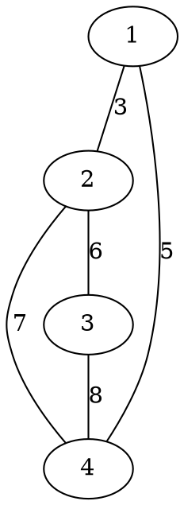

[[TOC]]

### 题意

要从原图里选出一些道路进行改造，满足：

1. 这些道路能把所有点连通
2. 在连通前提下，选的道路数量尽量少
3. 在满足前两条后，选中道路里最大的分值尽量小

最后输出两件事：

- 最少需要改造多少条路
- 这种最优方案下，最大分值是多少

#### 样例图

这张图把样例中的道路和分值画出来：

如果选 `1-2`、`1-4`、`2-3` 这三条边，就已经能连通所有点。
这时一共选了 `3` 条边，也就是最少的 `n-1` 条。
其中最大分值是 `6`，所以样例输出 `3 6`。

### 思路

先看一个按定义做的小数据暴力：

@include-code(./brute.cpp, cpp)

暴力直接枚举所有恰好选 `n-1` 条边的方案：

- 看它能不能把所有点连起来
- 如果能，就统计这组边里的最大分值
- 取最小值

这个思路直观，但边多时当然不行。

先看条件 2：“在满足连通的情况下，改造的道路尽量少。”

连通一个 `n` 个点的无向图，最少只需要 `n-1` 条边，所以答案第一项一定是：

`n - 1`

接着看条件 3：在所有生成树里，让最大边权尽量小。

这题直接按边权从小到大做 Kruskal 就行：

1. 把所有边按分值升序排序
2. 能连通两个不同连通块的边就选
3. 直到选满 `n-1` 条边为止

为什么最后一条加入的边权就是最优答案？

因为 Kruskal 是按从小到大的顺序在“尽量早”地把图连起来。

如果在选到某条边权 `w` 时，图才第一次完全连通，那么说明：

- 所有边权 `< w` 的边，不足以让全图连通

所以任何满足要求的方案，最大边权都不可能小于 `w`。

而 Kruskal 又确实在边权 `w` 时做到了连通，因此这个 `w` 就是最小可能值。

### 代码

@include-code(./main.cpp, cpp)

### 复杂度

设点数为 `n`，边数为 `m`。

Kruskal 的复杂度是：

- 排序 `O(m log m)`
- 并查集合并 `O(m \alpha(n))`

总时间复杂度 `O(m log m)`，空间复杂度 `O(n + m)`。

### 总结

这题本质上是在生成树里求“最小瓶颈”。但不需要额外记复杂性质，直接抓住 Kruskal 的过程就够了：按边权从小到大连通全图时，最后一条被选中的边，就是最小可能的最大边。
