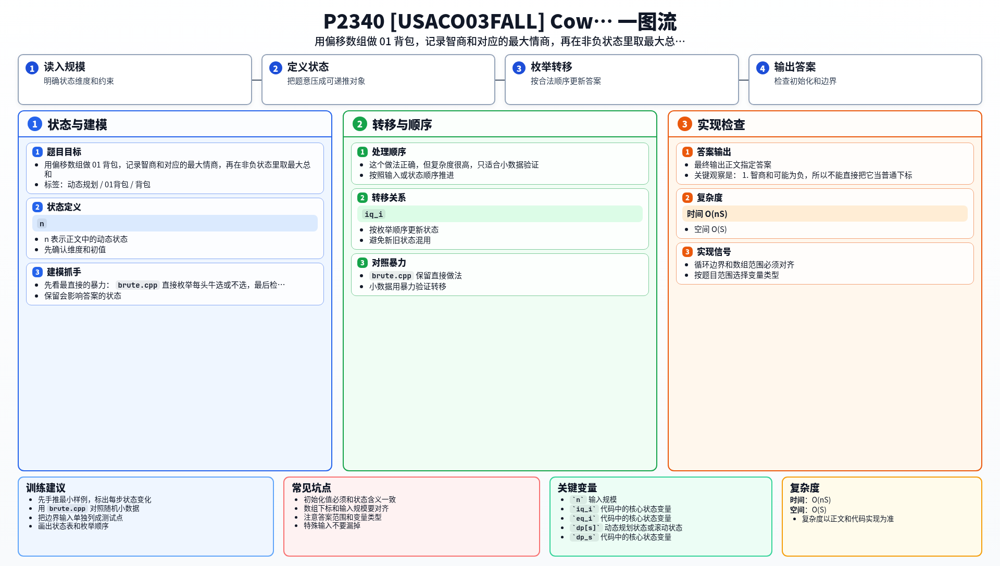

[[TOC]]

### 题意

有 `n` 头奶牛，每头奶牛有两个属性：

- 智商 `iq_i`
- 情商 `eq_i`

可以选择其中一些奶牛参加展览。
要求最后选出的奶牛满足：

- 智商和不小于 `0`
- 情商和不小于 `0`

在满足条件的前提下，希望 `智商和 + 情商和` 尽量大。

这张表把题意翻成了背包模型：

| 原题对象 | 背包含义 |
| --- | --- |
| 一头奶牛 | 一个 0/1 物品 |
| 智商 | 需要偏移的状态维度 |
| 情商 | 状态值 |
| 最终要求 | 选择后两个和都非负 |

### 思路

先看最直接的暴力：

@include-code(./brute.cpp, cpp)

`brute.cpp` 直接枚举每头牛选或不选，最后检查两个和是否都非负。

这个做法正确，但复杂度很高，只适合小数据验证。

关键观察是：

1. 智商和可能为负，所以不能直接把它当普通下标。
2. 只要把智商和整体向右平移一个足够大的偏移量，就能把负数状态变成非负下标。
3. 对于每个智商和，我们只需要记录能得到的最大情商和。

于是设：

- `dp[s]` 表示智商和为 `s - OFFSET` 时，能得到的最大情商和

这张表说明状态定义：

| 状态 | 含义 |
| --- | --- |
| `dp[s]` | 智商和为 `s - OFFSET` 时的最大情商和 |

处理一头奶牛 `(iq_i, eq_i)` 时：

- 不选它：状态保持不变
- 选它：智商和加 `iq_i`，情商和加 `eq_i`

如果 `iq_i` 非负，智商和会向右移动，倒序枚举；
如果 `iq_i` 为负，智商和会向左移动，正序枚举。

最后只在智商和非负、情商和非负的状态里，取 `智商和 + 情商和` 的最大值。

#### DP 公式

设偏移量为 $OFFSET$，$dp_s$ 表示智商和为 $s-OFFSET$ 时能得到的最大情商和。初始化：

$$
dp_{OFFSET}=0
$$

处理一头智商为 $a_i$、情商为 $b_i$ 的牛时：

$$
dp_{s+a_i}=\max(dp_{s+a_i},\ dp_s+b_i)
$$

最终只在智商和、情商和都非负的状态中取最大：

$$
\max_{s\ge OFFSET,\ dp_s\ge 0}\left((s-OFFSET)+dp_s\right)
$$

公式解释：智商和可能为负，所以用偏移量把它变成数组下标。`dp_s` 保存这个智商和下能达到的最大情商和，最后只允许智商和、情商和都非负的状态参与答案。

### 代码

@include-code(./main.cpp, cpp)

### 复杂度

- 时间复杂度：`O(nS)`，其中 `S` 是偏移数组的有效范围
- 空间复杂度：`O(S)`

### 总结

这题的核心是“负数权值要偏移”。

把智商和作为状态下标后，情商和只需要作为状态值保存。
这样一来，题目就变成了一个带负数权值的 0/1 背包问题。

### 一图流解析

这张图把本题的建模、关键转移、实现检查和训练方法压缩到一页，适合读完正文后复盘。

