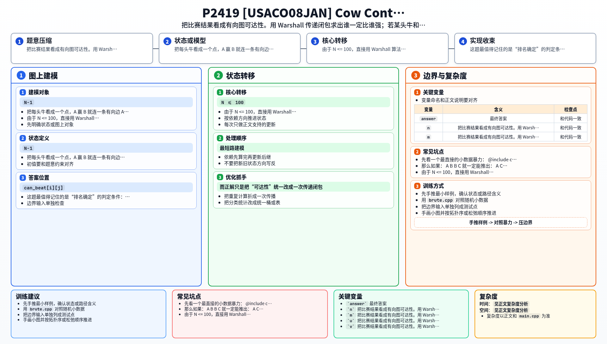

[[TOC]]

### 题意

有 `N` 头奶牛，水平有严格排名，没有并列。  
已知若干场比赛结果，`A` 赢 `B` 就说明：

- `A` 的水平一定比 `B` 强

要求统计：  
有多少头奶牛的具体排名已经可以完全确定。

### 思路

先看一个最直接的小数据暴力：

@include-code(./brute.cpp, cpp)

暴力做法是：

1. 对每头牛，沿“赢”的关系做一次 DFS，统计它一定能赢谁
2. 再沿反图做一次 DFS，统计谁一定能赢它
3. 如果这两个数量加起来正好是 `N-1`，说明它和其它所有牛的相对强弱都已知

这个做法已经很接近正解了。  
而正解只是把“可达性”统一改成一次传递闭包。

把每头牛看成一个点，`A` 赢 `B` 就连一条有向边 `A -> B`。  
那么如果：

- `A -> B`
- `B -> C`

就一定能推出：

- `A -> C`

这正是传递闭包问题。

由于 `N <= 100`，直接用 Warshall 算法最方便：

- `can_beat[i][j]` 表示 `i` 是否一定比 `j` 强

转移就是：

- 如果 `i` 能赢 `k`，`k` 能赢 `j`
- 那么 `i` 也能赢 `j`

传递闭包做完后，对某头牛 `i`：

- 如果对每一头其它牛 `j`
- 都满足 `i` 能赢 `j`，或者 `j` 能赢 `i`

那就说明 `i` 和所有其它牛的相对位置都确定了，  
于是它的排名也就唯一确定。

### 代码

@include-code(./main.cpp, cpp)

### 复杂度

Warshall 传递闭包：

- `O(N^3)`

最后统计答案：

- `O(N^2)`

总复杂度：

- `O(N^3)`

空间复杂度：

- `O(N^2)`

### 总结

这题最值得记住的是“排名确定”的判定条件：

- 和其它所有点的相对强弱都已知

而“已知强弱关系”本质上就是有向图可达性。  
所以这题本质不是最短路，而是 Floyd/Warshall 风格的传递闭包题。

### 一图流解析

这张图把本题的建模、关键转移、实现检查和训练方法压缩到一页，适合读完正文后复盘。

