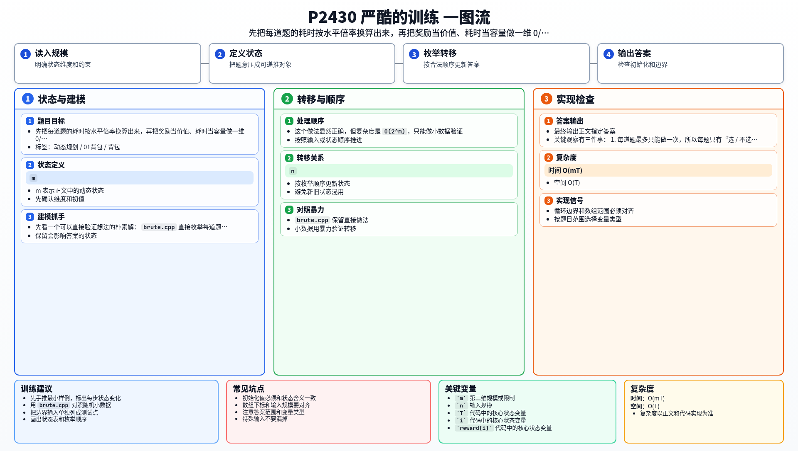

[[TOC]]

### 题意

给出：

- WKY 的水平值
- 老王的水平值
- `m` 道题，每道题有所属知识点和奖励值
- `n` 个知识点，已知老王做该知识点题目的耗时
- 总时间上限 `T`

题目保证老王的水平值是 WKY 的整数倍，所以同一道题里：

- `WKY 耗时 = 老王耗时 × (老王水平值 / WKY水平值)`

每道题最多做一次，要求在总时间不超过 `T` 的前提下，让 WKY 得到的总奖励值最大。

这张表把样例中的 6 道题翻译成了真正要选的“物品”：

| 题号 | 知识点 | 老王耗时 | WKY 耗时 | 奖励 |
| --- | --- | --- | --- | --- |
| 1 | 1 | 1 | 2 | 5 |
| 2 | 2 | 2 | 4 | 6 |
| 3 | 3 | 3 | 6 | 3 |
| 4 | 4 | 4 | 8 | 8 |
| 5 | 3 | 3 | 6 | 3 |
| 6 | 4 | 4 | 8 | 5 |

样例里水平倍率是 `2`，所以同一知识点下的题都会一起乘上 `2`。
从表里可以看到，原题最后只剩下“若干个物品选不选一次，总时间不能超过 20，总奖励尽量大”这个结构。

### 思路

先看一个可以直接验证想法的朴素解：

@include-code(./brute.cpp, cpp)

`brute.cpp` 直接枚举每道题做或不做，统计总时间和总奖励。

这个做法显然正确，但复杂度是 `O(2^m)`，只能做小数据验证。

关键观察有三件事：

1. 每道题最多只能做一次，所以每题只有“选 / 不选”两种决策。
2. 同一知识点下的题，对 WKY 来说耗时完全一样。
3. 奖励值和知识点无关，因此每道题都可以独立看成一个物品。

于是把第 `i` 道题翻译成一个 0/1 物品：

- 重量：`cost[i] = topic_time[p] * (wang_skill / wky_skill)`
- 价值：`reward[i]`

接下来就是标准一维 0/1 背包。

这张表说明 DP 状态到底在表示什么：

| 状态 | 含义 |
| --- | --- |
| `dp[t]` | 总时间不超过 `t` 时，能够得到的最大奖励值 |

有了这个定义之后，处理一件物品时就只有两种情况：

- 不选它：`dp[t]` 保持原值
- 选它：从 `dp[t - cost[i]]` 转移过来，再加上这道题的奖励

所以转移是：

- `dp[t] = max(dp[t], dp[t - cost[i]] + reward[i])`

由于每道题只能做一次，时间这一维必须倒序枚举，避免同一题被重复使用。

最后输出 `dp[T]` 即可。

#### DP 公式

设 $dp_t$ 表示总时间不超过 $t$ 时能够得到的最大奖励值。处理第 $i$ 道题，耗时为 $cost_i$，奖励为 $reward_i$，则：

$$
dp_t=\max(dp_t,\ dp_{t-cost_i}+reward_i)
$$

其中 $t\ge cost_i$，且时间倒序枚举。最终答案为：

$$
dp_T
$$

公式解释：每道题最多做一次，耗时是容量消耗，奖励是收益。若选择当前题，就必须从剩余时间 `t-cost_i` 的最优状态转移过来。

### 代码

@include-code(./main.cpp, cpp)

### 复杂度

- 时间复杂度：`O(mT)`
- 空间复杂度：`O(T)`

### 总结

这题的关键不是题面背景，而是把它翻译成背包：

- 每道题就是一个只能选一次的物品
- WKY 的耗时由“知识点耗时 × 水平倍率”得到
- 奖励值就是背包价值

以后看到“每个对象最多选一次、总时间或总容量有限、目标是收益最大”这类条件时，就可以优先往一维 0/1 背包上想。

### 一图流解析

这张图把本题的建模、关键转移、实现检查和训练方法压缩到一页，适合读完正文后复盘。

