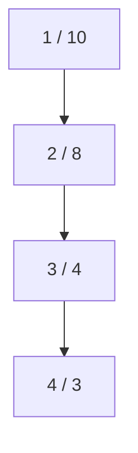

[[TOC]]

### 题意

给出一棵组织树和每个节点当前的属性值。

查询 `1 x` 要求回答：离 `x` 最近、并且和 `x` 有公共萌元素的上司是谁。
这里“有公共萌元素”等价于两个属性值有公共质因子，也就是 `gcd > 1`。

修改 `2 x y` 则把节点 `x` 的属性值改成 `y`。

### 思路

最直接的办法是每次查询都沿父链往上找第一个 `gcd > 1` 的祖先。

先看一个可以直接验证想法的朴素解：

@include-code(./brute.cpp, cpp)

`brute.cpp` 每次查询都暴力爬父链，适合帮助理解和对拍。但如果树很深、查询很多，这样最坏会到 `O(nq)`。

真正的突破口在于：修改次数最多只有 `50` 次。

#### 样例路径

这张图展示样例树，节点里同时写出编号和属性值：

例如查询节点 `3` 时，它的属性值是 `4 = 2^2`。
沿路径往上看，节点 `2` 的属性值 `8 = 2^3` 也含质因子 `2`，而且它比节点 `1` 更近，所以答案是 `2`。
这说明题目的关键不在 gcd 本身，而在“当前路径上，哪个祖先最近含有某个公共质因子”。

所以可以把问题改写成：

1. 先把每个点的属性值分解成不同质因子
2. DFS 整棵树时，对每个质因子维护一个“当前路径出现栈”
3. 到达节点 `u` 时，枚举 `u` 的所有质因子
4. 每个质因子的栈顶，都是一个候选最近祖先
5. 在这些候选里选深度最大的那个，就是答案

由于修改次数很少，我们不必做复杂在线结构。每次修改后，重新分解该点质因子，再整树 DFS 重算一遍 `answer[u]` 即可。

### 代码

@include-code(./main.cpp, cpp)

### 复杂度

每次整树重算都只需 DFS 一遍，并枚举每个点有限个不同质因子，所以单次可视为 `O(n)`。修改次数最多 `50`，因此总复杂度约为 `O((修改次数 + 1) * n + 操作数)`，空间复杂度是 `O(n)`。

### 总结

这题的关键是抓住“更新少、查询多”这个结构特征。与其为每次查询单独向上找，不如每次修改后把整棵树的答案一次性重算出来。
