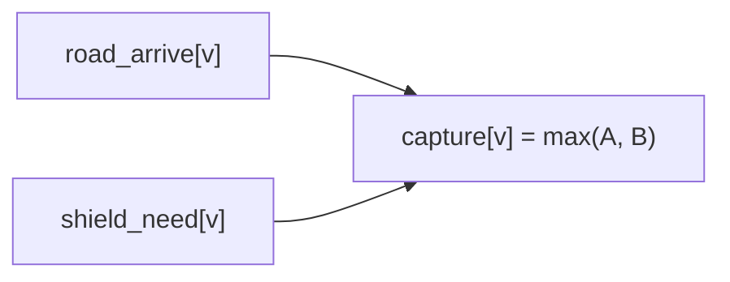
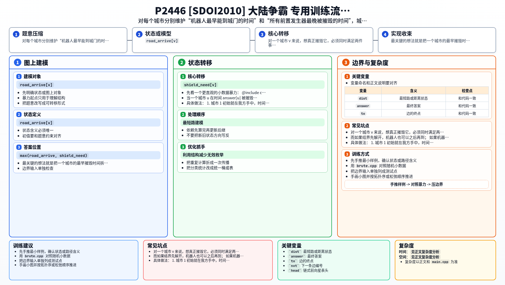

[[TOC]]

### 题意

有 `N` 个城市和 `M` 条单向道路，从城市 `1` 出发，要摧毁城市 `N`。

但进入某个城市之前，必须先摧毁维持它结界的所有发生器。  
这些发生器分布在其他城市中。

机器人是无限的。  
一旦机器人进入某个城市，就可以立刻自爆并摧毁这个城市里的一个目标，因此这个城市里的发生器也会在那一刻被摧毁。

问最短多久能摧毁城市 `N`。

### 思路

先看一个更直观的小数据暴力：

@include-code(./brute.cpp, cpp)

`brute.cpp` 的想法很直接：

1. 每次暴力枚举当前“最早可能被摧毁”的那个城市
2. 摧毁它之后：
   - 它会沿着道路给别的城市带来更早的到达时间
   - 它作为发生器，也会解开一批城市的结界限制
3. 重复这个过程直到首都被摧毁

这个过程最贴题意，但大数据下用暴力找下一个城市太慢。

#### 两个时间都要维护

对一个城市 `v` 来说，想真正摧毁它，必须同时满足两件事：

1. 至少有一个机器人已经能到达它的城门
2. 它的所有前置发生器都已经被摧毁

所以我们分别维护两个量：

- `road_arrive[v]`：最早什么时候能有机器人到达 `v`
- `shield_need[v]`：为了进入 `v`，它所有前置发生器最晚被摧毁的时间

那么城市 `v` 真正能被摧毁的最早时间就是：

- `max(road_arrive[v], shield_need[v])`

这张图展示的就是这个关系：

图里真正要看的，是“路走到了”还不够，结界也必须同时解开。  
而如果结界先解开，机器人也可以之后再到；  
如果机器人先到，理论上也可以在城外等到结界全部失效。

#### 为什么可以像 Dijkstra 一样做

当一个城市 `u` 在时间 `answer[u]` 被摧毁之后，它只会带来两类影响：

1. 沿道路更新别的城市的 `road_arrive`
2. 作为发生器，更新它所控制城市的 `shield_need`

这两类信息都会让别的城市“更早可达”，不会让答案变差。  
因此我们可以像 Dijkstra 那样，每次取当前最早能被摧毁的城市继续扩展。

具体做法：

1. 城市 `1` 初始就在我方手中，时间记为 `0`
2. 用优先队列维护当前候选的最早摧毁时间
3. 每摧毁一个城市，就更新：
   - 它沿道路能到达的城市
   - 依赖它作为发生器的城市
4. 如果某个城市已经满足：
   - 所有前置发生器都处理完
   - 并且已有机器人能到它门口
   
   就可以用 `max(road_arrive, shield_need)` 去尝试更新答案

### 代码

@include-code(./main.cpp, cpp)

### 复杂度

设发生器依赖关系总数为 `R`。

每条道路最多参与常数次松弛，每条依赖关系也只会处理一次。  
优先队列复杂度为：

- `O((M + R) log N)`

空间复杂度：

- `O(M + R + N)`

### 总结

这题表面上像最短路，实际上多了一层“结界前置条件”。

最关键的想法就是把一个城市的最早摧毁时间拆成两部分：

1. 机器人最早什么时候能到
2. 前置发生器最晚什么时候才会全部被摧毁

最后取两者最大值。  
一旦这个式子想清楚，整题就能顺着 Dijkstra 的推进方式写出来。

### 一图流解析

这张图把本题的建模、关键转移、实现检查和训练方法压缩到一页，适合读完正文后复盘。

