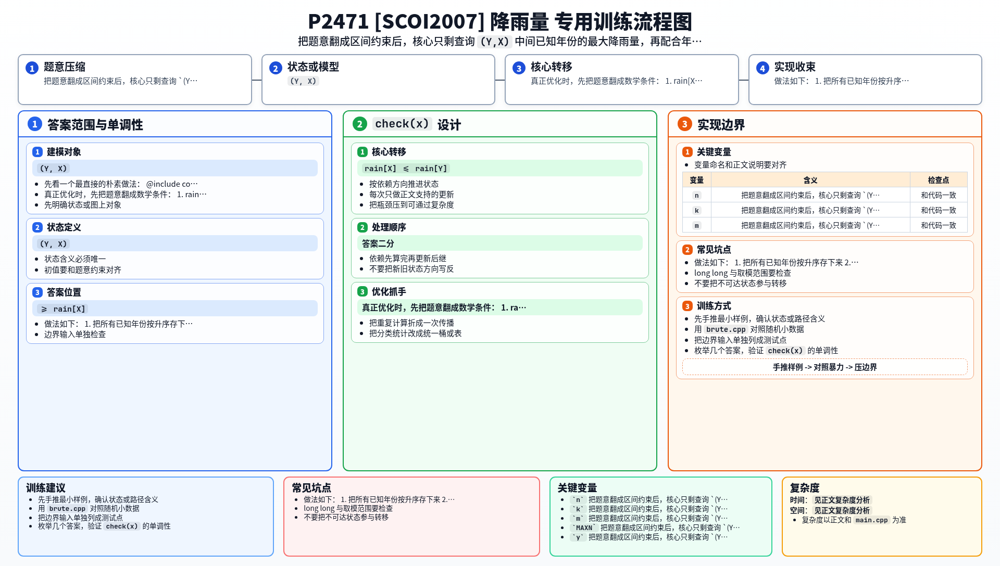

[[TOC]]

### 题意

给出若干个有记录的年份和对应降雨量。

对于每个询问 `(Y, X)`，判断这句话是否成立：

`X 年是自 Y 年以来降雨量最多的`

题意中的“最多”并不是通常的“大于等于”，而是：

- `rain[X] <= rain[Y]`
- 对所有 `Y < Z < X`，都有 `rain[Z] < rain[X]`

由于有些年份没有记录，答案可能是：

- `true`：一定成立
- `false`：一定不成立
- `maybe`：目前信息下无法确定

### 思路

先看一个最直接的朴素做法：

@include-code(./brute.cpp, cpp)

`brute.cpp` 对每个询问直接扫描所有已知年份，找出落在 `(Y, X)` 中间的记录，再按定义判断。

这个做法的逻辑很适合帮助理解题意，也适合做小数据对拍。

真正优化时，先把题意翻成数学条件：

1. `rain[X] <= rain[Y]`
2. 中间所有年份 `Z` 都满足 `rain[Z] < rain[X]`

于是每个询问的关键矛盾只剩一个：

`(Y, X)` 中间的已知年份里，是否存在某个年份的降雨量 >= rain[X]`

这就变成了一个静态区间最大值查询问题。

做法如下：

1. 把所有已知年份按升序存下来
2. 用 `lower_bound` 找到 `Y`、`X` 在记录数组中的位置
3. 用 ST 表查询中间这段已知年份的最大降雨量
4. 根据 `Y`、`X` 是否存在，分四种情况讨论

最重要的一类是 `Y`、`X` 都存在时：

- 若 `rain[X] > rain[Y]`，直接 `false`
- 若中间最大值 `>= rain[X]`，也直接 `false`
- 否则，若 `Y..X` 每一年都有记录，则结论被完全确定，输出 `true`
- 否则中间缺少年份，只能输出 `maybe`

其余三类情况本质上都是“已知数据没有形成矛盾就 `maybe`，形成矛盾就 `false`”。

### 代码

@include-code(./main.cpp, cpp)

### 复杂度

预处理 ST 表：

`O(n log n)`

每次询问：

- 二分找位置：`O(log n)`
- ST 表查区间最大值：`O(1)`

总时间复杂度：

`O(n log n + m log n)`

空间复杂度：

`O(n log n)`

### 总结

这题最关键的不是 ST 表本身，而是先把原句翻译成：

- 两个端点的大小关系
- 中间区间最大值的限制
- 记录是否完整连续

一旦把这三个判断条件拆清楚，代码就只是“二分 + RMQ + 分类讨论”。

### 一图流解析

这张图把本题的建模、关键转移、实现检查和训练方法压缩到一页，适合读完正文后复盘。

