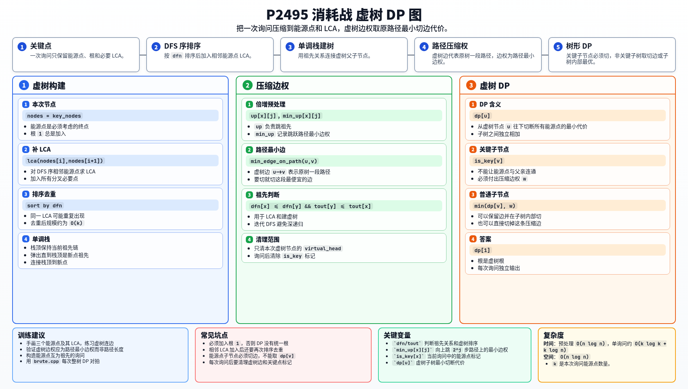

[[TOC]]

### 题意

给定一棵以 `1` 为根的带权树。每次询问给出若干个能源点，需要炸毁一些边，使根 `1` 无法到达任何能源点，并使总代价最小。

每次询问独立。

### 思路

先看一个可以直接验证想法的朴素解：

@include-code(./brute.cpp, cpp)

暴力做法是每次在整棵树上 DP，但询问很多，不能每次遍历 `n` 个点。

一次询问真正有用的点只有能源点、根，以及它们之间的必要 LCA。把这些点按原树祖先关系连起来，就是虚树。

虚树中一条边 `u -> v` 代表原树上从 `u` 到 `v` 的一段路径。若决定在这段路径中切一条边，显然应该切代价最小的那条。因此虚树边权是原树路径上的最小边权。

建虚树流程：

1. 把本次能源点按 DFS 序排序；
2. 加入相邻能源点的 LCA；
3. 加入根 `1`；
4. 再按 DFS 序排序去重；
5. 用单调栈连接父子虚树边。

虚树 DP：

- 如果子节点是能源点，必须在父子压缩路径上切断，代价为这条虚树边权；
- 如果子节点不是能源点，可以切掉这条虚树边，也可以保留它并在子树内部切，取较小值。

### 代码

@include-code(./main.cpp, cpp)

### 复杂度

预处理 `O(n log n)`。

一次询问若有 `k` 个能源点，复杂度约为 `O(k log k + k log n)`。

空间复杂度为 `O(n log n)`。

### 总结

虚树的价值是把一次询问压缩到关键点规模。

本题还要注意虚树边权不是路径长度，而是原路径上的最小边权，因为这代表切断这段路径的最低代价。

### 一图流解析

这张图把本题的建模、关键转移、实现检查和训练方法压缩到一页，适合读完正文后复盘。

