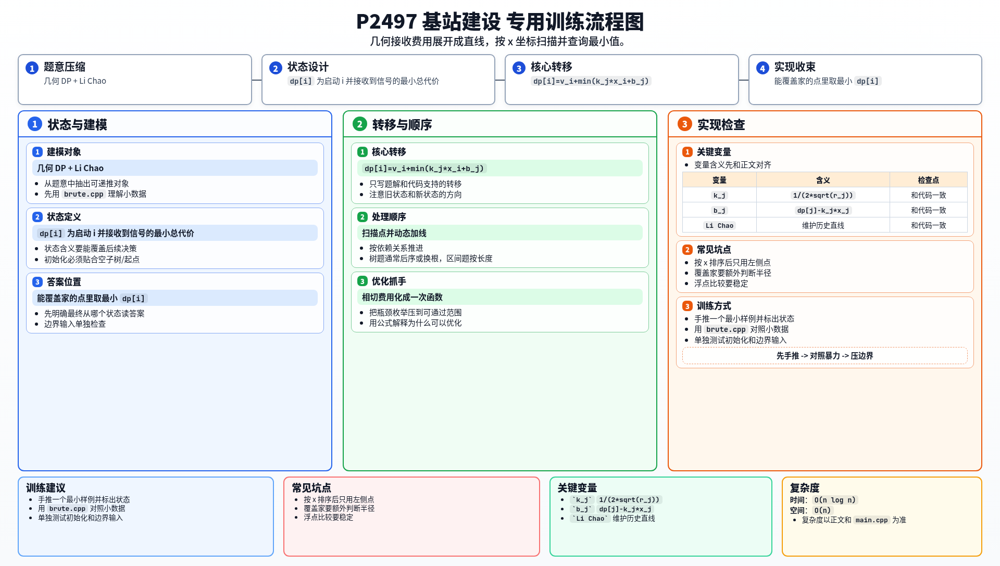

[[TOC]]

### 题意

一条直线上有若干个点：

- 最左边是移动公司
- 中间一些点是基站
- 右边某个位置是 up 主家

每个点 `i` 有：

- 位置 `x_i`
- 发射半径 `r_i`
- 启动费用 `v_i`

如果点 `i` 要从左边某个点 `j` 接收信号，那么必须满足两个圆相切，对应要额外付出接收费用 `sqrt(r'_i)`。

目标是用最小总代价，让某个能覆盖 up 主家的点接收到信号，并把信号继续传到 up 主家。

### 思路

先看一个小数据朴素 DP：

@include-code(./brute.cpp, cpp)

把所有点按 `x` 从小到大排序。

设 `dp[i]` 表示：

“把第 `i` 个点启动，并且让它成功从左边收到信号”的最小总代价。

第一个点就是移动公司本身，所以：

`dp[1] = v_1`

若 `j < i`，那么从 `j` 向 `i` 传信号时，几何条件是两个圆相切。

因为发送圆半径固定为 `r_j`，接收圆半径可调，且圆心都在地面上，所以有：

`(x_i - x_j)^2 = 4 * r_j * r'_i`

于是：

`sqrt(r'_i) = (x_i - x_j) / (2 * sqrt(r_j))`

这就是从 `j` 向 `i` 传信号的额外接收费用。

因此转移为：

`dp[i] = v_i + min( dp[j] + (x_i - x_j) / (2 * sqrt(r_j)) )`

把和 `i` 有关的部分展开：

`dp[i] = v_i + min( dp[j] - x_j / (2 * sqrt(r_j)) + x_i / (2 * sqrt(r_j)) )`

对固定的 `j` 来说，这是关于 `x_i` 的一条直线：

`y = k_j * x_i + b_j`

其中：

- `k_j = 1 / (2 * sqrt(r_j))`
- `b_j = dp[j] - k_j * x_j`

所以问题变成：

按 `x` 从小到大枚举每个点 `i`，查询所有左侧点对应直线在 `x_i` 处的最小值。

这正是 Li Chao Tree 的标准应用。

最后，只要某个点的发射圆能覆盖 up 主家，也就是满足：

`|x_i - home_x| <= r_i`

那么就可以用 `dp[i]` 更新答案。

#### DP 转移方程

核心状态：

`dp[i]` 为启动 i 并接收到信号的最小总代价

核心转移：

`dp[i]=v_i+min(k_j*x_i+b_j)`

答案收束：

能覆盖家的点里取最小 `dp[i]`

### 代码

@include-code(./main.cpp, cpp)

### 复杂度

时间复杂度 `O(n log n)`，空间复杂度 `O(n)`。

### 总结

这题表面是几何，核心其实是把几何费用公式整理成直线。

一旦写出：

- 每个已建好的点 `j` 对应一条直线
- 每个新点 `i` 只是在自己的 `x_i` 处查询最小值

Li Chao Tree 就是最自然的正解。

### 一图流解析

这张图把本题的建模、关键转移、实现检查和训练方法压缩到一页，适合读完正文后复盘。

