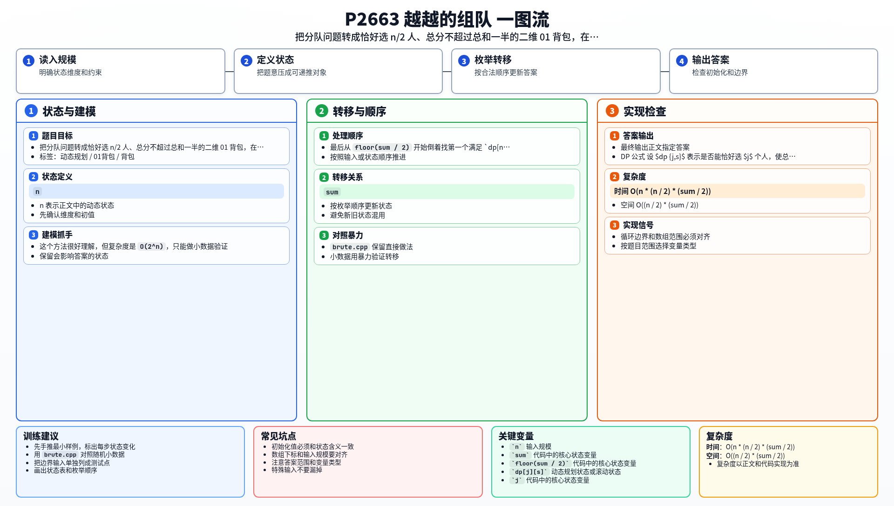

[[TOC]]

### 题意

给出 `n` 个学生的分数，要从中恰好选出 `n / 2` 个人。

设全班总分为 `sum`，要求这 `n / 2` 个人的总分：

- 不超过 `sum / 2`
- 并且尽量大

也就是把一队的人数固定成一半，并让这队总分尽量贴近总分的一半。

### 思路

先看最直接的暴力：

@include-code(./brute.cpp, cpp)

`brute.cpp` 对每个学生枚举“选 / 不选”，最后检查是否恰好选了 `n / 2` 人，以及总分是否不超过 `floor(sum / 2)`。

这个方法很好理解，但复杂度是 `O(2^n)`，只能做小数据验证。

这题本质上是 01 背包，只不过除了“总分上限”之外，还多了一个限制：

- 必须恰好选 `n / 2` 个人

因此设：

- `dp[j][s]` 表示是否能恰好选 `j` 个人，使总分恰好为 `s`

加入一个分数 `a[i]` 时：

- 不选他：状态不变
- 选他：如果 `dp[j - 1][s - a[i]]` 为真，那么 `dp[j][s]` 也为真

由于每个学生只能选一次，所以 `j` 和 `s` 都必须倒序枚举。

#### 状态表

| 状态 | 含义 |
| --- | --- |
| `dp[j][s]` | 是否能恰好选 `j` 人，且总分恰好为 `s` |

#### 小例子

如果当前已经处理过分数 `2, 3, 4`，并且只看“选 2 个人”的可达状态，那么：

| 选人数 | 可达总分 |
| --- | --- |
| `0` | `0` |
| `1` | `2, 3, 4` |
| `2` | `5, 6, 7` |

这个表说明：DP 其实并不关心具体选了哪几个人，只关心“选了几个人”和“总分是多少”这两个信息。

最后从 `floor(sum / 2)` 开始倒着找第一个满足 `dp[n / 2][s] = true` 的 `s`，就是答案。

#### DP 公式

设 $dp_{j,s}$ 表示是否能恰好选 $j$ 个人，使总分恰好为 $s$。初始化：

$$
dp_{0,0}=true
$$

处理分数为 $a_i$ 的人时：

$$
dp_{j,s}=dp_{j,s}\lor dp_{j-1,s-a_i}
$$

最终从 $\lfloor sum/2\rfloor$ 开始向下找最大的 $s$，满足：

$$
dp_{n/2,s}=true
$$

公式解释：`dp_{j,s}` 只回答“能不能选出 `j` 个人总分为 `s`”。每加入一个人，就可以把所有少选一个人、少这份分数的可达状态推到新状态；最后找最接近一半总分的可达值。

### 代码

@include-code(./main.cpp, cpp)

### 复杂度

- 时间复杂度：`O(n * (n / 2) * (sum / 2))`
- 空间复杂度：`O((n / 2) * (sum / 2))`

### 总结

看到下面这种条件组合时，要优先想到“附加维度的 01 背包”：

- 每个元素最多选一次
- 总和不能超过某个上限
- 还要额外控制恰好选几个

这题正是把“人数”作为第二维状态，最后在所有合法状态中取最优答案。

### 一图流解析

这张图把本题的建模、关键转移、实现检查和训练方法压缩到一页，适合读完正文后复盘。

