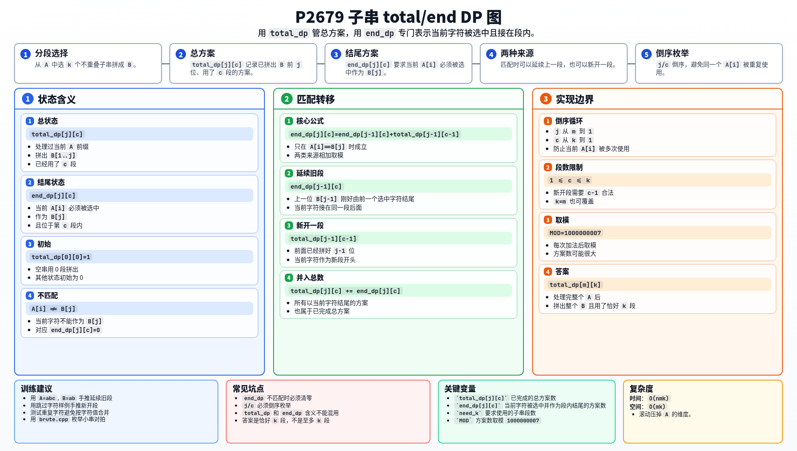

[[TOC]]

### 题意

给定字符串 `A`、`B` 和整数 `k`。要从 `A` 中取出 `k` 个互不重叠的非空子串，按它们在 `A` 中出现的顺序拼接起来，要求结果等于 `B`。求方案数。

### 思路

朴素做法是枚举 `k` 个子串的位置，再判断拼接结果是否等于 `B`。

先看一个可以直接验证想法的朴素解：

@include-code(./brute.cpp, cpp)

正式做法从左到右扫描 `A`。设：

- `total_dp[j][c]`：处理过当前 `A` 前缀后，已经拼出 `B` 的前 `j` 位，并且用了 `c` 段的总方案数；
- `end_dp[j][c]`：当前 `A` 字符必须被选中，作为 `B[j]`，并且它位于第 `c` 段内的方案数。

如果 `A[i] == B[j]`，那么选中 `A[i]` 有两种情况：

```text
end_dp[j][c] = end_dp[j-1][c] + total_dp[j-1][c-1]
```

- `end_dp[j-1][c]`：延续上一段，当前字符接在已经选中的上一字符后面；
- `total_dp[j-1][c-1]`：新开一段，前面已经用 `c-1` 段拼出 `B` 的前 `j-1` 位。

得到新的 `end_dp[j][c]` 后，把它加入 `total_dp[j][c]`。如果 `A[i] != B[j]`，当前字符不能匹配 `B[j]`，对应的 `end_dp[j][c]` 要清零。

为了避免同一个 `A[i]` 被重复使用，`j` 和 `c` 都倒序枚举。

### 代码

@include-code(./main.cpp, cpp)

### 复杂度

时间复杂度 `O(n*m*k)`。

空间复杂度 `O(m*k)`。

### 总结

这题的关键是区分“已经完成的总方案”和“当前字符必须被选中且接在某一段内的方案”。有了 `end_dp`，延续旧段和新开一段这两种来源就能被清楚地拆开。

### 一图流解析

这张图把本题的建模、关键转移、实现检查和训练方法压缩到一页，适合读完正文后复盘。


