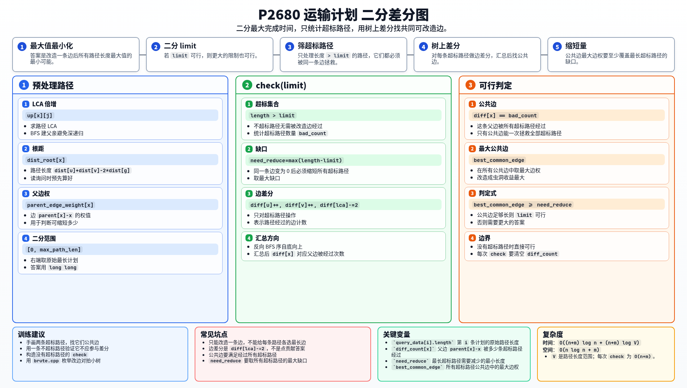

[[TOC]]

### 题意

给定一棵带权树和若干运输计划，每个计划是一条树上路径。

可以选择一条边改造成虫洞，使这条边通过时间变为 `0`。所有计划同时开始，完成时间取决于改造后最长的计划路径。要求这个最长时间最小。

### 思路

先看一个可以直接验证想法的朴素解：

@include-code(./brute.cpp, cpp)

暴力枚举哪条边变成虫洞，再计算所有路径最大值，能帮助理解题意，但复杂度太高。

这是“最大值最小化”，考虑二分答案 `limit`。

对一条计划路径：

- 如果原长度 `<= limit`，它已经满足要求；
- 如果原长度 `> limit`，它必须经过我们选中的虫洞边，否则不会变短。

因此固定 `limit` 后，只需要关注所有超标路径。虫洞边必须同时满足：

1. 被所有超标路径共同经过；
2. 边权至少为 `max(路径长度 - limit)`，这样才能把最长的超标路径降到 `limit` 以内。

如何找“所有超标路径的公共边”？

使用树上边差分。对每条超标路径 `u -> v`，设 `g = lca(u, v)`：

```text
diff[u]++
diff[v]++
diff[g] -= 2
```

自底向上汇总后，点 `x` 的差分值表示边 `parent[x] - x` 被多少条超标路径经过。若这个值等于超标路径总数，说明这条边是所有超标路径的公共边。

在所有公共边中找最大边权，判断它能否提供足够的缩短量即可。

### 代码

@include-code(./main.cpp, cpp)

### 复杂度

预处理 LCA 和路径长度为 `O((n+m) log n)`。

每次检查为 `O(n+m)`，二分约 `O(log V)` 次，其中 `V` 是路径长度范围。

空间复杂度为 `O(n log n + m)`。

### 总结

这道题的关键是不要为每条路径单独选最长边，因为全局只能改造同一条边。

二分答案后，只看超标路径；能拯救它们的边必须是所有超标路径的公共边，这正好可以用树上边差分统计。

### 一图流解析

这张图把本题的建模、关键转移、实现检查和训练方法压缩到一页，适合读完正文后复盘。



