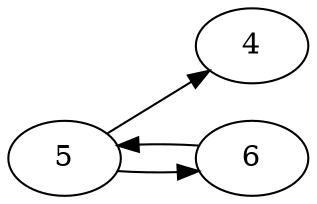

[[TOC]]

### 题意

每个摄像头站在一个位置上，并会监视若干个固定地点。

如果某个摄像头所在的位置没有被其它摄像头监视，那么它就能被砸掉；砸掉以后，它也就不再监视别人。

问最后还能剩下多少个摄像头。

### 思路

#### 关系图

这张图展示“监视关系”如何转成有向图：

边 `u -> v` 表示 `u` 在监视 `v` 所在的位置。
因此点 `v` 只有在没有其它点指向它时，才可以被砸掉。
像图中的 `5` 和 `6` 互相监视，就会形成一个删不掉的环。

先看一个小数据暴力：

@include-code(./brute.cpp, cpp)

暴力是在“当前还剩哪些摄像头”这个状态上不断搜索，枚举哪些摄像头现在可以砸掉。它能帮助理解过程，但正式解法没必要真的去搜顺序。

关键建模是：

- 如果摄像头 `u` 监视到了摄像头 `v` 所在的位置，就连边 `u -> v`。
- 那么摄像头 `v` 当前能被砸掉，当且仅当没有其它点指向它，也就是当前入度为 `0`。

于是题目就完全变成了：

- 反复删除入度为 `0` 的点
- 每删掉一个点，就把它发出的边一并删除

这就是标准的 Kahn 拓扑排序过程。

实现时先用 `cameras_at_pos[x]` 记录每个位置上有哪些摄像头。然后枚举摄像头 `u` 监视的每个地点 `y`，把位置正好为 `y` 的所有摄像头都连成 `u -> v`。

代码里把这部分单独写成了一个 `TopologicalSort` 结构，接口和你算法书里的拓扑模板保持一致：`add_edge()` 负责加边，`kahn_prune()` 负责反复删除入度为 `0` 的点。

最后做一次队列版拓扑删除，被删掉的点数记作 `removed`，答案就是 `n - removed`。

### 代码

@include-code(./main.cpp, cpp)

### 复杂度

设建图后总边数为 `E`，时间复杂度 `O(n + E)`，空间复杂度 `O(n + E)`。

### 总结

这题表面上是一个“不断砸摄像头”的过程题，实质上就是有向图删点。把“可砸”翻译成“入度为 0”，题目就直接落成拓扑排序模板了。
