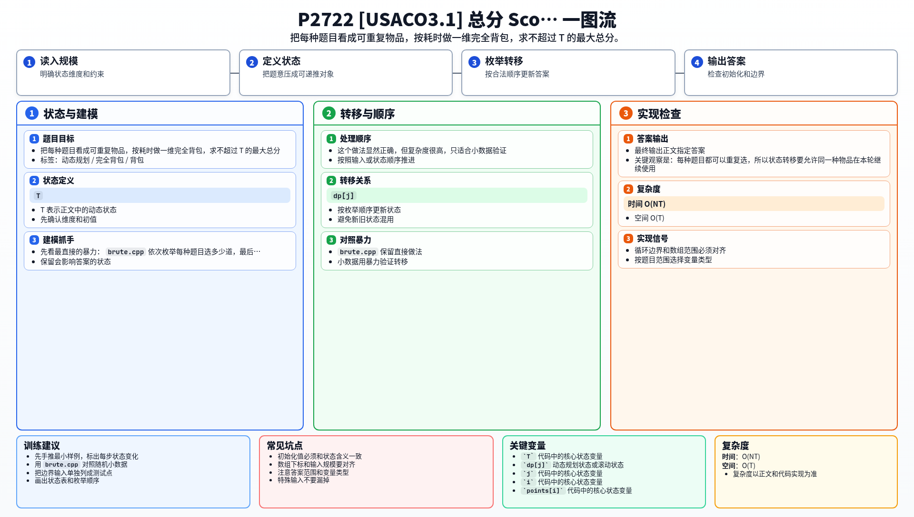

[[TOC]]

### 题意

有若干种题目，每种题目都有：

- 完成一道题所需的时间
- 完成一道题得到的分数

每种题目可以选很多道，要求在总时间不超过 `T` 的前提下，让总分最大。

这张表把题目翻译成了背包模型：

| 原题对象 | 背包含义 |
| --- | --- |
| 一种题目 | 一个可以重复使用的物品 |
| 完成时间 | 物品重量 |
| 获得分数 | 物品价值 |
| 总时间 `T` | 背包容量 |

从这里可以看出，本题是标准的完全背包最大值模型。

### 思路

先看最直接的暴力：

@include-code(./brute.cpp, cpp)

`brute.cpp` 依次枚举每种题目选多少道，最后检查总时间是否超限。

这个做法显然正确，但复杂度很高，只适合小数据验证。

关键观察是：每种题目都可以重复选，所以状态转移要允许同一种物品在本轮继续使用。

于是设：

- `dp[j]` 表示时间不超过 `j` 时能获得的最大全分

这张表说明状态定义：

| 状态 | 含义 |
| --- | --- |
| `dp[j]` | 时间不超过 `j` 时能获得的最大全分 |

处理第 `i` 种题目 `(points[i], cost[i])` 时：

- 不选它：`dp[j]` 保持原值
- 选它：从 `dp[j - cost[i]]` 转移过来，再加上 `points[i]`

因为同一种题目可以重复选，所以容量必须正序枚举：

- `dp[j] = max(dp[j], dp[j - cost[i]] + points[i])`

最后输出 `dp[T]` 即可。

#### DP 公式

设 $dp_j$ 表示时间不超过 $j$ 时能获得的最大全分。对于分值 $points_i$、耗时 $cost_i$ 的题型：

$$
dp_j=\max(dp_j,\ dp_{j-cost_i}+points_i)
$$

同一种题型可以重复选，所以容量正序枚举。最终答案为：

$$
dp_T
$$

公式解释：题型可以重复做，所以是完全背包最大值。若本次再做一道耗时 `cost_i` 的题，就从剩余时间的最优分数转移并加上这题分值。

### 代码

@include-code(./main.cpp, cpp)

### 复杂度

- 时间复杂度：`O(NT)`
- 空间复杂度：`O(T)`

### 总结

这题就是完全背包的标准模板题：

- 每种题目可以重复选
- 容量正序枚举
- 目标是最大化总分

以后看到“同一种选择可以重复做、总时间有限、总收益尽量大”这类条件时，就可以直接往完全背包上想。

### 一图流解析

这张图把本题的建模、关键转移、实现检查和训练方法压缩到一页，适合读完正文后复盘。

