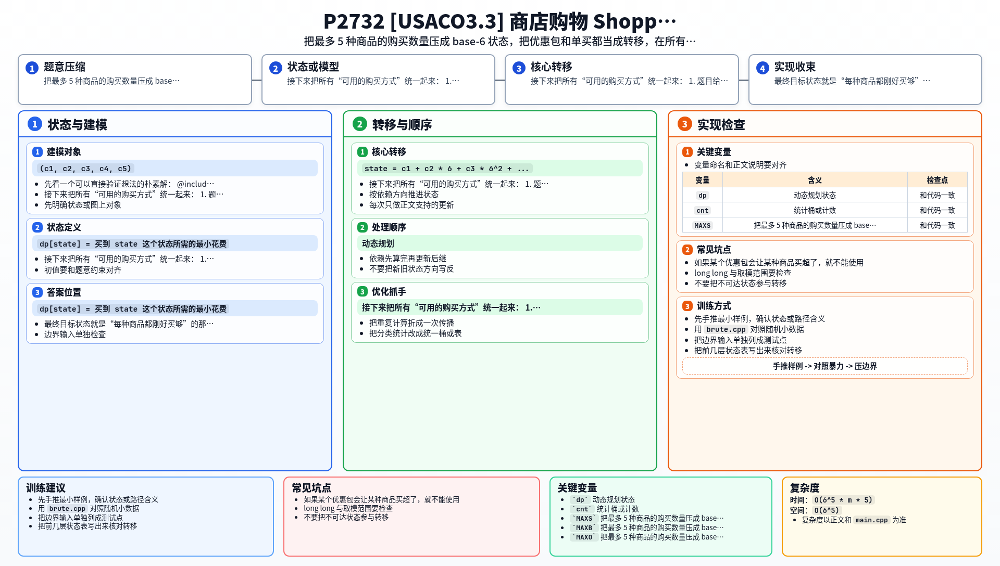

[[TOC]]

### 题意

商店里有若干种优惠包，每个优惠包会把若干件商品打包出售。

最后顾客只关心 `b` 种商品，每种商品给出：

- 商品编号
- 需要购买的件数
- 单买价格

要求恰好买到这些商品，不能多买，并让总花费最小。

### 思路

先看一个可以直接验证想法的朴素解：

@include-code(./brute.cpp, cpp)

因为最多只会买 `5` 种商品，而且每种需要的数量也不大，所以最自然的状态就是：

`(c1, c2, c3, c4, c5)`

表示当前已经买了多少件。

为了让程序更好写，可以把它编码成一个 `6` 进制数：

`state = c1 + c2 * 6 + c3 * 6^2 + ...`

这样每个状态都唯一对应一种购买情况。

接下来把所有“可用的购买方式”统一起来：

1. 题目给出的优惠包
2. 每种商品单独买 1 件

于是每个优惠包都可以看成一次状态转移：

- 它让某几种商品的购买数增加
- 总花费增加这个优惠包的价格

正式做法是正向 DP：

`dp[state] = 买到 state 这个状态所需的最小花费`

从全 0 状态开始，枚举每个优惠包，尝试转移到下一个状态。  
如果某个优惠包会让某种商品买超了，就不能使用。

最终目标状态就是“每种商品都刚好买够”的那个编码值。

### 代码

@include-code(./main.cpp, cpp)

### 复杂度

因为最多只有 `5` 种商品，每种数量按 `0..5` 处理，状态总数最多是：

`6^5 = 7776`

设可用优惠包总数为 `m`，则：

- 时间复杂度 `O(6^5 * m * 5)`
- 空间复杂度 `O(6^5)`

### 总结

这题的关键不是优惠怎么选，而是先把“购买数量”变成小状态。

一旦把每种商品当前已买数量看成状态，题目就变成非常标准的“小状态最小花费 DP”。

### 一图流解析

这张图把本题的建模、关键转移、实现检查和训练方法压缩到一页，适合读完正文后复盘。

