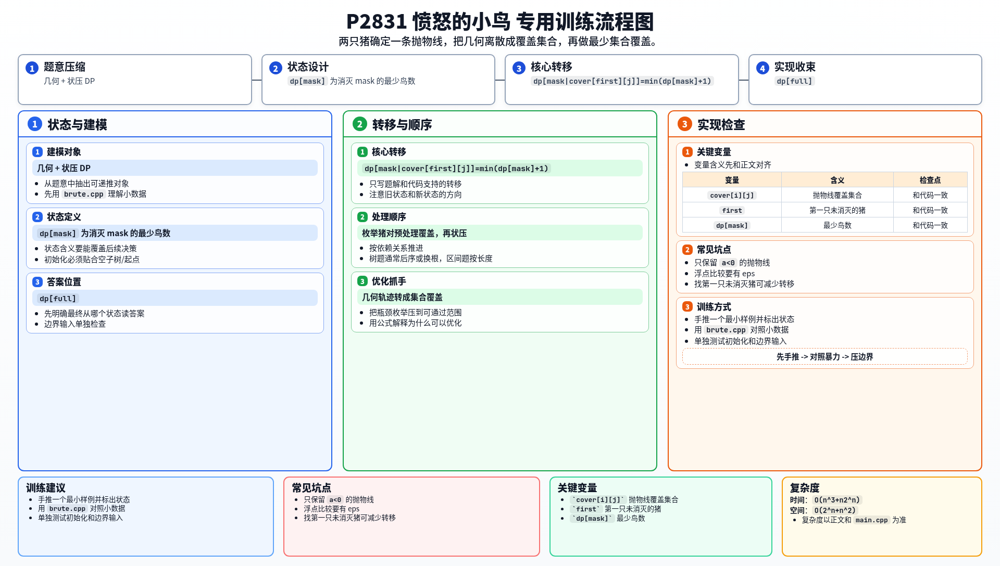

[[TOC]]

### 题意

每次可以发射一只沿着 `y = ax^2 + bx`（且 `a<0`）飞行的小鸟。

如果轨迹经过某只小猪，这只小猪就会被消灭。
问最少需要多少只小鸟才能消灭所有小猪。

### 思路

先看一个小数据回溯：

@include-code(./brute.cpp, cpp)

正解的关键不是直接搜索抛物线，而是先把“有意义的抛物线”离散出来。

注意到一条过原点的二次函数 `y=ax^2+bx`，只要再给出两只小猪，就能唯一确定 `a,b`。

所以可以枚举两只小猪 `i,j`：

1. 解出对应的 `a,b`
2. 若 `a<0`，说明这是一条合法轨迹
3. 再检查这条轨迹还能经过哪些小猪

这样每条合法抛物线都会对应到一个覆盖集合 `cover[i][j]`。

接下来就是状压 DP：

- `dp[mask]` 表示消灭 `mask` 这些小猪最少需要多少只小鸟

#### DP 转移方程

设 `cover[first][j]` 表示一条经过 `first` 和 `j` 的合法抛物线能消灭的小猪集合，则：

$$
dp[mask \mid cover[first][j]]
=\min(dp[mask \mid cover[first][j]],\ dp[mask]+1)
$$

如果只单独打一只 `first`，就把 `cover[first][j]` 换成 `1<<first`。

转移时，找到第一只还没被打掉的猪 `first`：

- 可以单独打一只它
- 或者枚举另一只猪 `j`，用 `cover[first][j]` 一次打一批

因为任意最优方案中的一条抛物线，只要能打一只以上的猪，就一定会在某个 `cover[i][j]` 中出现，所以不会漏解。

### 代码

@include-code(./main.cpp, cpp)

### 复杂度

预处理 `O(n^3)`，状压 DP 约 `O(n 2^n)`。

### 总结

这题的核心是把几何问题离散化成集合覆盖问题。
一旦把抛物线预处理成覆盖集合，后面的部分就是标准状压 DP。

### 一图流解析

这张图把本题的建模、关键转移、实现检查和训练方法压缩到一页，适合读完正文后复盘。

