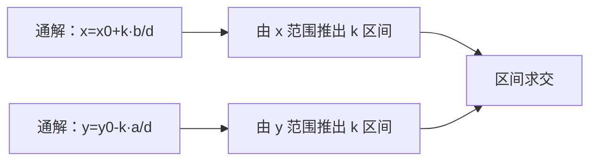

[[TOC]]

### 题意

给定：

`a x + b y + c = 0`

以及矩形范围：

- `x ∈ [x1, x2]`
- `y ∈ [y1, y2]`

要求满足条件的整数解 `(x, y)` 有多少对。

### 思路

先看一个最直接的小数据暴力：

@include-code(./brute.cpp, cpp)

暴力版就是直接枚举矩形里的所有整数点，看它们是否满足方程。  
这个思路很好理解，但区间很大时显然不能枚举。

先把方程改写成：

`a x + b y = -c`

若 `a,b` 都不为 `0`，设：

- `d = gcd(a,b)`

那么方程有整数解的充要条件是：

- `d` 能整除 `-c`

若无解，答案就是 `0`。

若有解，用 exgcd 求出一组特解 `(x0, y0)`。  
所有整数解可以写成：

- `x = x0 + k * (b/d)`
- `y = y0 - k * (a/d)`

这里 `k` 是任意整数。

接下来关键就变成：

- 哪些 `k` 会让 `x` 落在 `[x1, x2]`
- 哪些 `k` 会让 `y` 落在 `[y1, y2]`

只要分别把这两个条件转成对 `k` 的区间限制，再求交集大小即可。

这张图表示的就是这个过程：

图里真正要看的，是“二维平面里的点计数”已经被压成了“一维参数 `k` 的区间计数”。

另外还要单独处理几种退化情况：

1. `a = 0, b = 0`
2. `a = 0`
3. `b = 0`

因为这时通解形式会更简单，直接特判更稳。

### 代码

@include-code(./main.cpp, cpp)

### 复杂度

主过程是一遍 exgcd 加上常数次区间计算：

- `O(log max(|a|, |b|))`

空间复杂度：

- `O(1)`

### 总结

这题的关键不是“矩形里数点”，而是先把方程的整数解写成通解。

一旦写出：

- `x = x0 + k * (b/d)`
- `y = y0 - k * (a/d)`

后面的问题就只剩下：

- 参数 `k` 有多少个合法取值
