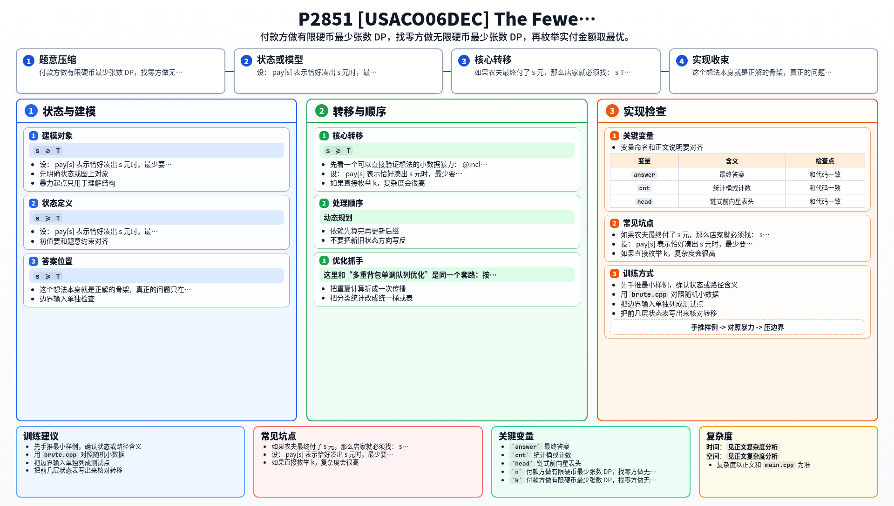

[[TOC]]

### 题意

要买一件价格为 `T` 的商品。

- 农夫手里的每种硬币数量有限
- 店家手里的每种硬币数量无限
- 希望“农夫付出的硬币数 + 店家找回的硬币数”最少

要求输出这个最小值。

### 思路

先看一个可以直接验证想法的小数据暴力：

@include-code(./brute.cpp, cpp)

暴力版直接做两件事：

1. 用有限硬币 DP 求出“农夫恰好付出 `s` 元时最少要几枚硬币”
2. 用无限硬币 DP 求出“店家恰好找 `d` 元时最少要几枚硬币”

最后枚举实付金额 `s >= T`，把两部分加起来取最小值。

这个想法本身就是正解的骨架，真正的问题只在于第一步。

#### 为什么要拆成两个 DP

如果农夫最终付了 `s` 元，那么店家就必须找：

- `s - T`

于是总硬币数就是：

- `pay[s] + change[s - T]`

其中：

- `pay[s]`：农夫用自己手里有限的硬币，恰好凑出 `s` 的最少张数
- `change[d]`：店家用无限硬币，恰好找出 `d` 的最少张数

第二部分是很标准的完全背包最小值。  
难点在第一部分：每种硬币数量有限，而且我们要求的是**最少张数**，这是一个多重背包最小值问题。

#### 付款方 DP

设：

- `pay[s]` 表示恰好凑出 `s` 元时，最少要用多少枚自己的硬币

如果当前处理面值 `v`、数量 `c` 的硬币，那么转移是：

- `new[s] = min(old[s - k * v] + k)`，其中 `0 <= k <= c`

这就是最朴素的多重背包。

如果直接枚举 `k`，复杂度会很高。  
这里和“多重背包单调队列优化”是同一个套路：按 `mod v` 的余数分组。

把：

- `s = q * v + r`

代进去，就得到：

- `new[q * v + r] = min(old[t * v + r] + (q - t))`

其中 `t` 落在一个长度为 `c + 1` 的滑动窗口里。

于是对每个余数类，只要维护：

- `old[t * v + r] - t`

的窗口最小值，就能把这一层转移优化到线性。

#### 找零方 DP

店家硬币无限，所以是完全背包最小值：

- `change[d] = min(change[d], change[d - v] + 1)`

这一部分很直接。

#### 为什么只需要枚举到 `T + Vmax^2`

设最大面值是 `Vmax`。这题的经典结论是：

- 最优方案中，多付的钱不需要超过 `Vmax^2`

因此只要把农夫实付金额枚举到：

- `T + Vmax^2`

就够了。

在本题里 `Vmax <= 120`，所以这个范围最多就是：

- `10000 + 120^2 = 24400`

完全可以做 DP。

这也是为什么正解能稳稳落在 `O(NW)` 级别。

### 代码

@include-code(./main.cpp, cpp)

### 复杂度

设 `W = T + Vmax^2`。

- 付款方多重背包单调队列优化：`O(NW)`
- 找零方完全背包：`O(NW)`

总时间复杂度：

- `O(NW)`

空间复杂度：

- `O(W)`

### 总结

这题最关键的不是“怎么找零”，而是先把问题拆开：

1. 农夫负责付钱，是有限硬币最少张数
2. 店家负责找零，是无限硬币最少张数

拆完以后，真正有技术含量的只剩第一部分的多重背包优化。  
所以这题本质上是一个“最小值版的多重背包 + 完全背包拼接题”。

### 一图流解析

这张图把本题的建模、关键转移、实现检查和训练方法压缩到一页，适合读完正文后复盘。

