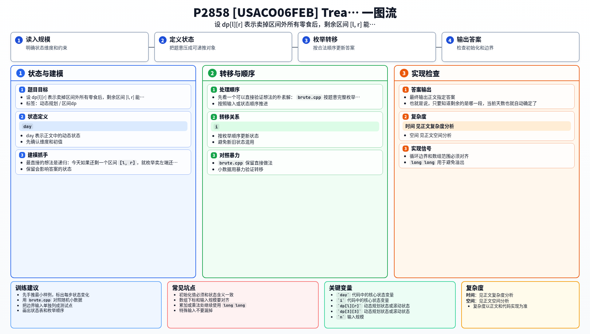

[[TOC]]

### 题意

给出一排零食，每天只能从最左端或最右端拿走一个卖掉。

第 `day` 天卖出的第 `i` 个零食，收益是 `v_i * day`。要求安排一个最优卖法，使总收益最大。

### 思路

最直接的想法是递归：今天如果还剩一个区间 `[l, r]`，就枚举卖左端还是卖右端。

先看一个可以直接验证想法的朴素解：

@include-code(./brute.cpp, cpp)

`brute.cpp` 按题意完整枚举每天的选择，复杂度是指数级，只适合做小数据对拍。

关键观察是：当剩余区间为 `[l, r]` 时，已经卖掉了 `n - (r - l + 1)` 个零食，所以今天一定是第 `n - (r - l + 1) + 1` 天。也就是说，只要知道剩余的是哪一段，当前天数也就自动确定了。

因此设 `dp[l][r]` 表示当前只剩区间 `[l, r]` 时，后续能获得的最大收益。那么只有两种转移：

- 先卖左端：`dp[l + 1][r] + v_l * day`
- 先卖右端：`dp[l][r - 1] + v_r * day`

这张表展示几个典型状态的含义：

| 状态 | 当前是哪一天 | 表示什么 |
| --- | --- | --- |
| `dp[3][3]` | 第 `n` 天 | 只剩一个零食，今天必须卖掉 |
| `dp[2][4]` | 第 `n-2` 天 | 剩下中间连续三段时，后续的最大收益 |
| `dp[1][n]` | 第 `1` 天 | 一开始所有零食都还在，也就是最终答案 |

读这张表时，重点是把“区间长度”和“当前天数”对应起来。这样状态里就不需要额外再记一天编号，二维区间 DP 就足够了。按区间长度从小到大递推，最终得到 `dp[1][n]`。

#### DP 公式

设 $dp_{l,r}$ 表示当前只剩区间 $[l,r]$ 时，后续能获得的最大收益。此时天数由区间长度决定：

$$
day=n-(r-l+1)+1
$$

可以先卖左端或右端：

$$
dp_{l,r}=\max\left(dp_{l+1,r}+v_l\cdot day,\ dp_{l,r-1}+v_r\cdot day\right)
$$

边界为：

$$
dp_{i,i}=v_i\cdot n
$$

最终答案为：

$$
dp_{1,n}
$$

公式解释：剩余区间长度决定当前是第几天，所以状态不必额外记录天数。每一步只能卖左端或右端，卖掉后进入更短的区间，收益加上当前天数乘对应价值。

### 代码

@include-code(./main.cpp, cpp)

### 复杂度

共有 `O(n^2)` 个区间状态，每个状态只做 `O(1)` 转移，所以时间复杂度是 `O(n^2)`，空间复杂度是 `O(n^2)`。

### 总结

这题的关键不是贪心选左右端，而是识别出“剩余连续区间”就是完整状态。把暴力搜索改写成区间 DP 后，复杂度就从指数级降到了 `O(n^2)`。

### 一图流解析

这张图把本题的建模、关键转移、实现检查和训练方法压缩到一页，适合读完正文后复盘。

