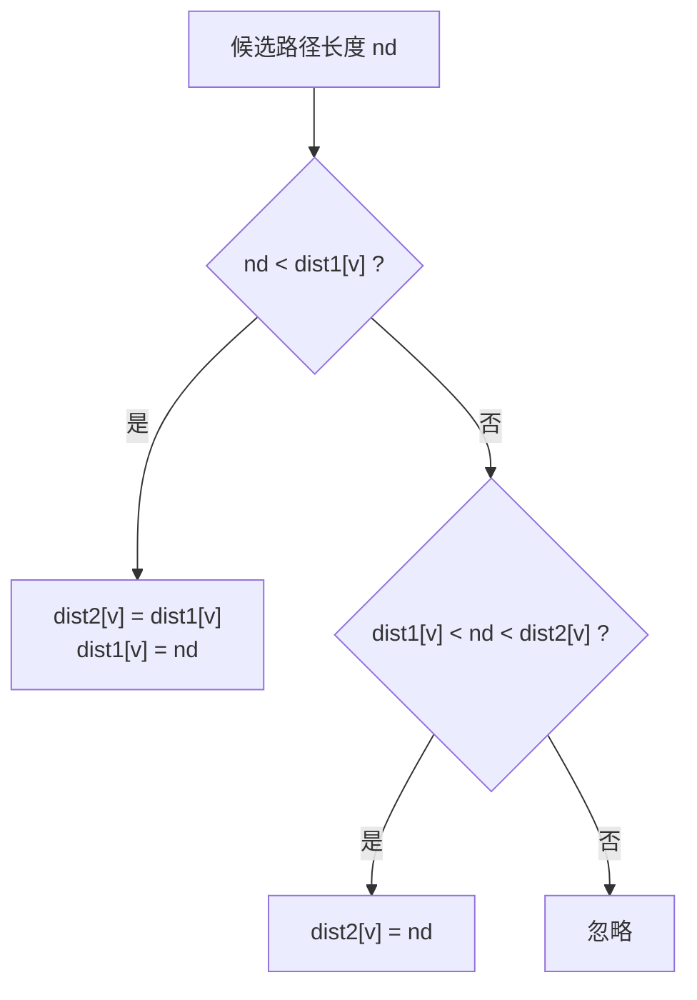
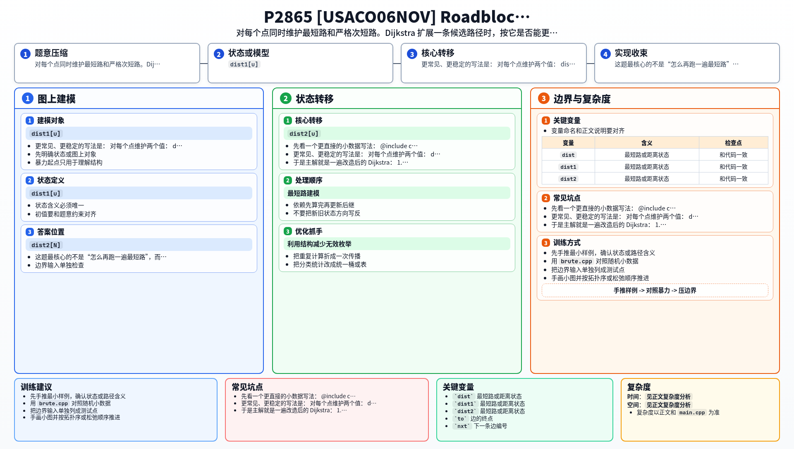

[[TOC]]

### 题意

给你一张无向带权图，起点是 `1`，终点是 `N`。

要求的不是最短路，而是：

- 严格大于最短路长度的最小那条路径长度

也就是说，如果有很多条最短路长度都一样，它们都只能算“最短路”，不能算次短路。  
真正的次短路必须比最短路更长一点，但又尽量短。

题目还特别说明：

- 次短路允许重复经过点
- 也允许重复经过边

### 思路

先看一个更直接的小数据写法：

@include-code(./brute.cpp, cpp)

`brute.cpp` 的思路是：

1. 用优先队列按路径长度从小到大枚举“走到某个点的候选路径”
2. 某个点第一次弹出，得到它的最短路
3. 某个点第二次弹出，得到它的严格次短路
4. 因此终点 `N` 第二次弹出时，答案就出来了

这个想法是正确的，但如果只按“弹出次数”来写，会有不少重复状态。

更常见、更稳定的写法是：  
对每个点维护两个值：

- `dist1[u]`：到 `u` 的最短路
- `dist2[u]`：到 `u` 的严格次短路

当我们从 `u` 走一条边到 `v`，得到候选值 `nd` 时，只有两种有意义的更新：

1. `nd < dist1[v]`
   - 说明找到了更短的最短路
   - 原来的 `dist1[v]` 有机会降级成次短路
2. `dist1[v] < nd < dist2[v]`
   - 说明 `nd` 不能当最短路，但可以更新严格次短路

这个转移过程可以用下面这张图来理解：

注意中间那个严格不等号非常关键：

- `nd == dist1[v]` 不能算次短路

因为题目要的是“长度严格大于最短路”的最小值。

于是主解就是一遍改造后的 Dijkstra：

1. 初始化 `dist1[1] = 0`
2. 其余 `dist1`、`dist2` 都是无穷大
3. 每次从堆里取一个候选状态 `(u, d)`
4. 枚举邻边，尝试更新 `dist1[v]` 和 `dist2[v]`
5. 最终输出 `dist2[N]`

### 代码

@include-code(./main.cpp, cpp)

### 复杂度

每条边至多触发常数次有效更新，优先队列操作是 `log N`。

总时间复杂度：

- `O(M log N)`

空间复杂度：

- `O(N + M)`

### 总结

这题最核心的不是“怎么再跑一遍最短路”，而是要把状态想清楚：

- 每个点不是只维护一个最优值
- 而是要同时维护“最短”和“严格次短”两个答案

一旦这个状态定义稳定下来，后面的转移其实和普通 Dijkstra 很接近。

### 一图流解析

这张图把本题的建模、关键转移、实现检查和训练方法压缩到一页，适合读完正文后复盘。

