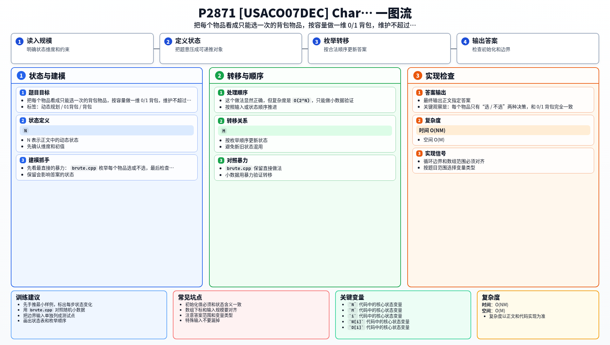

[[TOC]]

### 题意

有 `N` 件物品和一个容量为 `M` 的背包。

- 第 `i` 件物品有重量 `W[i]`
- 第 `i` 件物品有价值 `D[i]`
- 每件物品最多只能选一次

要求在总重量不超过 `M` 的前提下，让总价值最大。

这张表把题目直接翻译成了背包模型：

| 原题对象 | 背包含义 |
| --- | --- |
| 一件物品 | 一个只能选一次的物品 |
| 重量 `W[i]` | 物品重量 |
| 价值 `D[i]` | 物品价值 |
| 背包容量 `M` | 背包容量 |

从表里可以看到，本题就是最标准的一维 0/1 背包。

### 思路

先看最直接的暴力：

@include-code(./brute.cpp, cpp)

`brute.cpp` 枚举每个物品选或不选，最后检查总重量是否超过 `M`。

这个做法显然正确，但复杂度是 `O(2^N)`，只能做小数据验证。

关键观察是：每个物品只有“选 / 不选”两种决策，和 0/1 背包完全一致。

所以设：

- `dp[j]` 表示容量不超过 `j` 时能获得的最大奖励

这张表说明状态定义：

| 状态 | 含义 |
| --- | --- |
| `dp[j]` | 容量不超过 `j` 时能获得的最大奖励 |

处理第 `i` 件物品 `(W[i], D[i])` 时：

- 不选它：`dp[j]` 保持原值
- 选它：从 `dp[j - W[i]]` 转移过来，再加上 `D[i]`

于是转移就是：

- `dp[j] = max(dp[j], dp[j - W[i]] + D[i])`

因为每件物品只能选一次，所以容量必须倒序枚举。

最后输出 `dp[M]` 即可。

#### DP 公式

设 $dp_j$ 表示容量不超过 $j$ 时能获得的最大奖励。处理重量 $W_i$、价值 $D_i$ 的物品时：

$$
dp_j=\max(dp_j,\ dp_{j-W_i}+D_i)
$$

其中 $j\ge W_i$，容量倒序枚举。最终答案为：

$$
dp_M
$$

公式解释：这是最标准的 0/1 背包。`dp_j` 表示容量 `j` 内的最大价值，选当前物品时消耗重量并增加奖励。

### 代码

@include-code(./main.cpp, cpp)

### 复杂度

- 时间复杂度：`O(NM)`
- 空间复杂度：`O(M)`

### 总结

这题是 0/1 背包最标准的模板题之一：

- 每个物品最多选一次
- 只有一个容量限制
- 目标是最大化总价值

以后看到这类题，就可以直接往一维 0/1 背包上想。

### 一图流解析

这张图把本题的建模、关键转移、实现检查和训练方法压缩到一页，适合读完正文后复盘。

