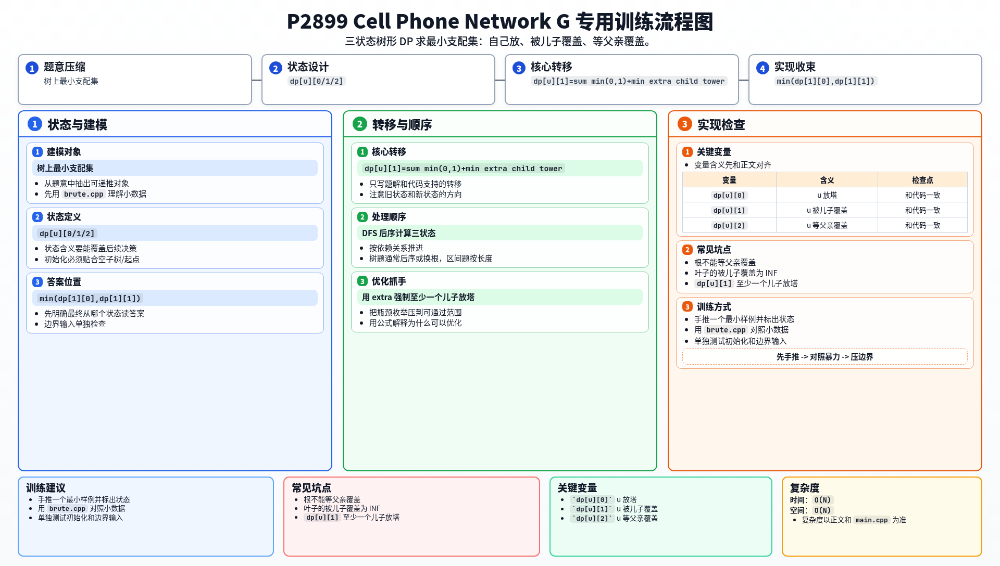

[[TOC]]

### 题意

在树上的一些节点放信号塔。

一个节点如果自己放了塔，或者与某个放塔节点相邻，就算被覆盖。
要求用最少的塔覆盖整棵树。

### 思路

先看一个只适合小数据验证的暴力：

@include-code(./brute.cpp, cpp)

`brute.cpp` 直接枚举哪些点放塔，再检查是否覆盖所有点。

正解是树上的最小支配集经典 DP。

设：

- `dp[u][0]`：`u` 放塔
- `dp[u][1]`：`u` 不放塔，但已经被儿子覆盖
- `dp[u][2]`：`u` 不放塔，等待父亲覆盖

它们都表示覆盖 `u` 子树所需的最少塔数。

转移分三种：

#### DP 转移方程

三种状态分别是“自己放塔 / 被儿子覆盖 / 等父亲覆盖”。
对每个儿子 `v`，核心转移可以写成：

$$
dp[u][0] = 1 + \sum_v \min(dp[v][0], dp[v][1], dp[v][2])
$$

$$
dp[u][2] = \sum_v \min(dp[v][0], dp[v][1])
$$

`dp[u][1]` 需要至少一个儿子放塔：

$$
dp[u][1]=\sum_v \min(dp[v][0],dp[v][1])
+ \min_v(dp[v][0]-\min(dp[v][0],dp[v][1]))
$$

1. `u` 放塔

   每个儿子都可以：

   - 放塔
   - 被自己的儿子覆盖
   - 等 `u` 覆盖

2. `u` 等父亲覆盖

   这时儿子不能再等 `u` 覆盖，所以每个儿子只能取：

   - 放塔
   - 被自己的儿子覆盖

3. `u` 被儿子覆盖

   必须至少有一个儿子放塔。
   这是整个题里唯一需要额外小心的限制。

所以本题本质上就是三状态树形 DP。

### 代码

@include-code(./main.cpp, cpp)

### 复杂度

一次 DFS，时间复杂度 `O(N)`，空间复杂度 `O(N)`。

### 总结

树上的“最少选点覆盖所有点”很容易想到最小支配集模型。
一旦把状态拆成“自己放 / 被儿子覆盖 / 等父亲覆盖”，转移就非常标准。

### 一图流解析

这张图把本题的建模、关键转移、实现检查和训练方法压缩到一页，适合读完正文后复盘。

