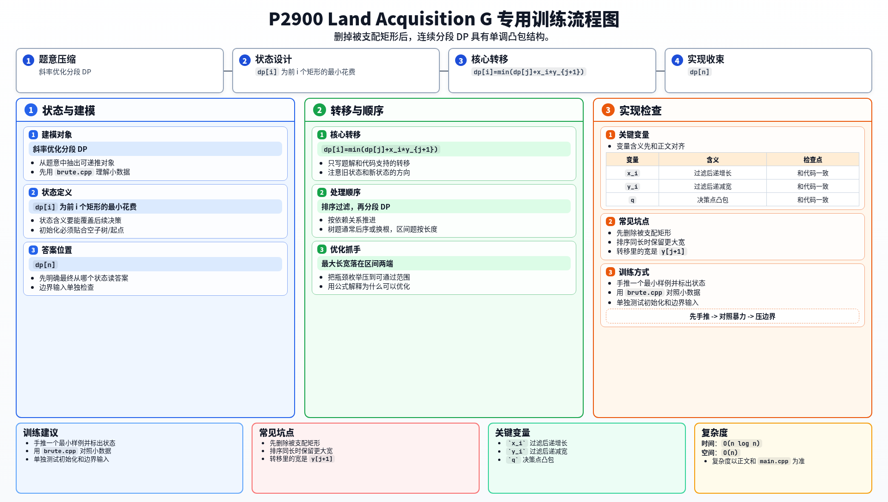

[[TOC]]

### 题意

每块土地有长和宽。

如果单买一块，花费是面积。
如果把若干块一起买，花费是：

`这一组最大的长 * 这一组最大的宽`

要求把所有土地分组，最小化总花费。

### 思路

先看朴素 DP：

@include-code(./brute.cpp, cpp)

关键先做一个预处理。

把矩形按长 `x` 递增排序；若长相同，则让宽 `y` 较大的排前面。

如果一个矩形满足：

- 长不大于另一个矩形
- 宽也不大于另一个矩形

那么它就是被支配矩形，可以删掉。

删完后，保留下来的矩形满足：

- `x` 递增
- `y` 递减

这时若最后一组是 `(j+1..i)`，它的代价就是：

`x_i * y_{j+1}`

因为这段里最大长一定是最后一个矩形的长，最大宽一定是第一个矩形的宽。

于是得到 DP：

`dp[i] = min(dp[j] + x_i * y_{j+1})`

这是标准斜率优化形式：

- 决策点 `j` 对应一条线
- 查询点是当前的 `x_i`

又因为保留下来的 `x_i` 单调递增、`y_{j+1}` 单调递减，所以可以用单调队列维护凸包。

#### DP 转移方程

核心状态：

`dp[i]` 为前 i 个矩形的最小花费

核心转移：

`dp[i]=min(dp[j]+x_i*y_{j+1})`

答案收束：

`dp[n]`

### 代码

@include-code(./main.cpp, cpp)

### 复杂度

时间复杂度 `O(n log n)`，空间复杂度 `O(n)`。

### 总结

这题真正的核心有两步：

1. 先删掉所有被支配矩形
2. 再把分组问题化成连续分段 DP

这样斜率优化的结构才会自然出现。

### 一图流解析

这张图把本题的建模、关键转移、实现检查和训练方法压缩到一页，适合读完正文后复盘。

