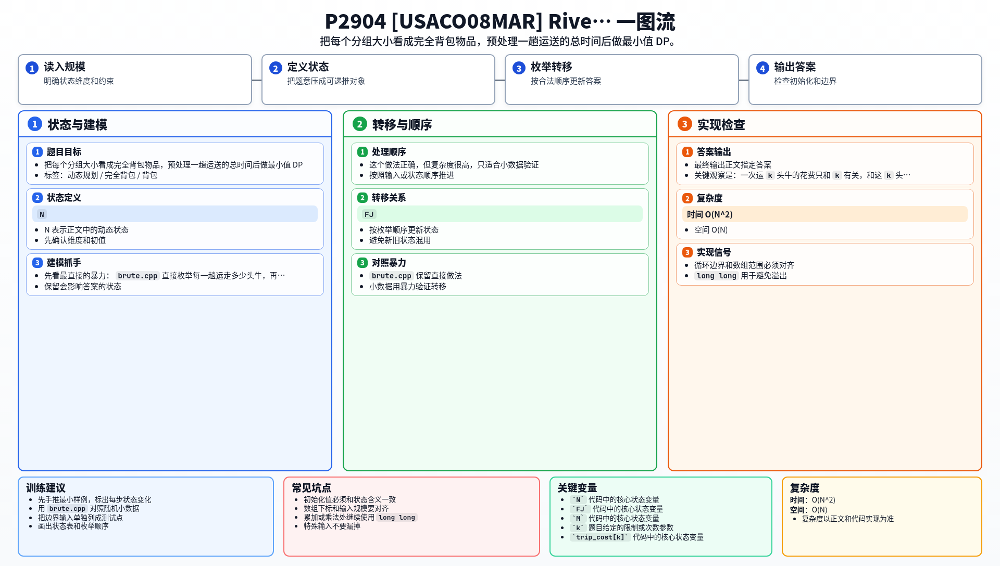

[[TOC]]

### 题意

有 `N` 头牛需要过河，船夫 `FJ` 必须一直在船上。

已知：

- 船夫单独过河要 `M` 分钟
- 如果一次带 `k` 头牛，那么总过河时间会按照题目给出的增量逐步变长
- 过完一趟之后，如果还有牛没过河，船夫还要再划回来

目标是把所有牛都运到对岸，并让总时间最小。

这张表把题意翻成了背包模型：

| 原题对象 | 背包含义 |
| --- | --- |
| 一次带 `k` 头牛过河 | 一个大小为 `k` 的物品 |
| 这一趟来回所花时间 | 物品代价 |
| 总共 `N` 头牛 | 背包容量 |

### 思路

先看最直接的暴力：

@include-code(./brute.cpp, cpp)

`brute.cpp` 直接枚举每一趟运走多少头牛，再统计总时间。

这个做法正确，但复杂度很高，只适合小数据验证。

关键观察是：一次运 `k` 头牛的花费只和 `k` 有关，和这 `k` 头牛是谁无关。
所以我们只需要关心“这一趟运了多少头牛”，不需要关心具体是哪几头。

于是先预处理：

- `trip_cost[k]` 表示“带 `k` 头牛来回一趟”的总时间

这张表说明状态定义：

| 状态 | 含义 |
| --- | --- |
| `dp[j]` | 运走 `j` 头牛的最小总时间 |

对于每个分组大小 `k`：

- 它可以重复使用很多次，所以是完全背包
- 转移是 `dp[j] = min(dp[j], dp[j - k] + trip_cost[k])`

最后所有牛都运走后，最后一次不需要再返回，所以答案要再减去一次单独返回的时间 `M`。

#### DP 公式

设 $trip_k$ 表示一次运走 $k$ 头牛并返回的总时间，$dp_j$ 表示运走 $j$ 头牛的最小总时间。初始化：

$$
dp_0=0
$$

每种载牛数量 $k$ 可以重复使用，因此：

$$
dp_j=\min(dp_j,\ dp_{j-k}+trip_k)
$$

最后一次不需要返回，答案为：

$$
dp_n-M
$$

公式解释：把一次运走 `k` 头牛看成一个可重复使用的选择。`dp_j` 表示已经运走 `j` 头的最小总时间，最后一次不用返回，所以要减去一次返回时间。

### 代码

@include-code(./main.cpp, cpp)

### 复杂度

- 时间复杂度：`O(N^2)`
- 空间复杂度：`O(N)`

### 总结

这题的关键不是“牛是谁”，而是“每一趟运走多少头牛”。

把“一趟运 `k` 头牛”的代价预处理出来后，就变成了标准的完全背包最小值问题：

- 物品大小是 `k`
- 物品代价是 `trip_cost[k]`
- 背包容量是 `N`
- 最后答案再减去一次返回时间 `M`

### 一图流解析

这张图把本题的建模、关键转移、实现检查和训练方法压缩到一页，适合读完正文后复盘。

