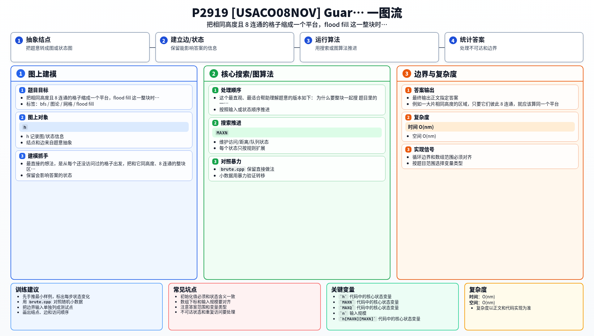

[[TOC]]

### 题意

给出一个高程矩阵。

如果若干个格子：

- 高度相同；
- 彼此 8 个方向连通；

那么它们可以看成同一个“平台”。

如果这个平台周围接触到的格子，除了地图边界外，全部都比它低，那么这个平台就是一个山顶。

要求统计整张图中有多少个山顶平台。

### 思路

最直接的想法，是从每个还没访问过的格子出发，把和它同高度、8 连通的整块区域都搜出来，看看这整块周围会不会碰到更高的格子。

这个最直观、最适合帮助理解题意的版本如下：

@include-code(./brute.cpp, cpp)

#### 为什么要整块一起搜

题目里的一个山顶，不一定只有一个格子。

例如一大片相同高度的区域，只要它们彼此 8 连通，就应该算同一个平台。如果只按单个格子判断，就会把一个平台重复统计很多次。

所以正确做法是：

1. 先找到一个还没访问过的格子；
2. 把和它同高度且 8 连通的所有格子一起搜出来；
3. 这一整块只判断一次、只统计一次。

#### 怎样判断一个平台是不是山顶

设当前平台高度为 `h`。

在 flood fill 整个平台的过程中，枚举每个格子的 8 个邻居：

- 如果邻居越界，说明碰到边界，不影响它成为山顶；
- 如果邻居高度比 `h` 低，也没问题；
- 如果邻居高度等于 `h`，它属于同一个平台，继续扩展；
- 如果邻居高度大于 `h`，说明这个平台旁边有更高的地方，它就不是山顶。

只要整个搜索过程中从未遇到更高邻居，这个平台就是一个山顶。

### 代码

@include-code(./main.cpp, cpp)

### 复杂度

- 时间复杂度：`O(nm)`
- 空间复杂度：`O(nm)`

每个格子只会被归入某一个平台一次，每次只检查 8 个方向。

### 总结

这题的关键是把“相同高度的 8 连通块”看成一个整体。

一旦这样理解，题目就变成了非常标准的网格 flood fill：搜整块、查周围、判断是否存在更高邻居。

### 一图流解析

这张图把本题的建模、关键转移、实现检查和训练方法压缩到一页，适合读完正文后复盘。

