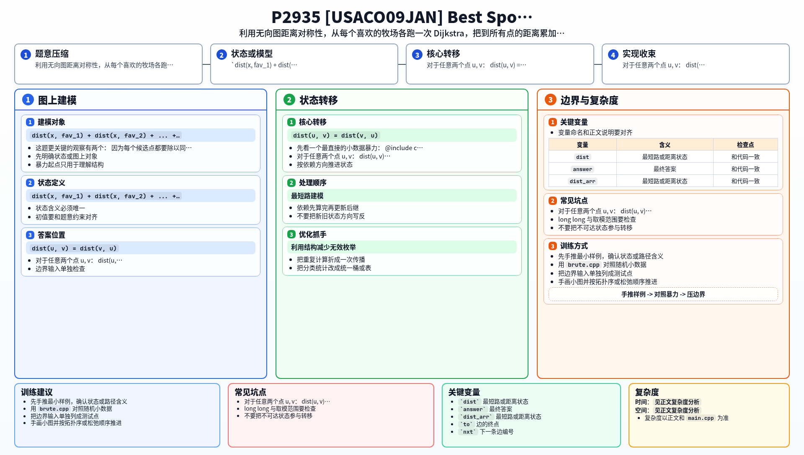

[[TOC]]

### 题意

给一个带正边权的无向图，其中有 `F` 个“喜欢的牧场”。

要求找一个牧场 `x`，使得：

- 从 `x` 到所有喜欢的牧场的距离平均值最小

输出这个最优牧场的编号。

因为平均值分母 `F` 对所有候选点都一样，所以本质上就是：

- 找一个点，使它到所有喜欢牧场的距离总和最小

样例里牧场 `10` 和 `11` 的总和一样，但输出是 `10`，所以代码按编号从小到大扫描，保留最先达到最优值的点。

### 思路

先看一个最直接的小数据暴力：

@include-code(./brute.cpp, cpp)

暴力做法用 Floyd 先求出任意两点最短路，然后枚举每个候选牧场 `x`，把：

`dist(x, fav_1) + dist(x, fav_2) + ... + dist(x, fav_F)`

全部加起来，取最小值即可。

这个写法很好理解，但它更像“直接把题做完”，没有抓住这道题真正想练的最短路模型。

这题更关键的观察有两个：

#### 1. 平均值最小，等价于总和最小

因为每个候选点都要除以同一个 `F`，所以比较平均值和比较总和完全一样。

#### 2. 无向图里距离是对称的

对于任意两个点 `u, v`：

`dist(u, v) = dist(v, u)`

所以如果我们想知道某个候选点 `x` 到所有喜欢点的距离和，其实等价于：

- 从每个喜欢点出发，求它到 `x` 的最短路
- 再把这些距离累加起来

于是就不必“枚举候选点再跑最短路”，而是改成：

1. 对每个喜欢的牧场跑一次 Dijkstra
2. 把这次最短路结果累加到所有点的答案里
3. 最后扫描一遍，找距离总和最小的牧场

这样做的好处是：

- 图是稀疏图，边权全为正，Dijkstra 很合适
- 如果喜欢的牧场数量 `F` 比 `P` 小，那么比“对每个点都跑一次最短路”更省

### 代码

@include-code(./main.cpp, cpp)

### 复杂度

设牧场数为 `P`，道路数为 `C`。

每次 Dijkstra 的复杂度是：

- `O((P + C) log P)`

一共跑 `F` 次，所以总复杂度是：

- `O(F (P + C) log P)`

空间复杂度：

- `O(P + C)`

### 总结

这题最值得记住的不是 Dijkstra 模板本身，而是前面的两步转化：

1. 平均值最小等价于总和最小
2. 无向图距离对称，所以可以从喜欢点反向出发统计

这样整题就从“枚举一个睡觉点，算它到很多目标点的距离”变成了：

- 多次单源最短路
- 距离累加

是很典型的“先换比较对象，再换枚举方向”的题。

### 一图流解析

这张图把本题的建模、关键转移、实现检查和训练方法压缩到一页，适合读完正文后复盘。

