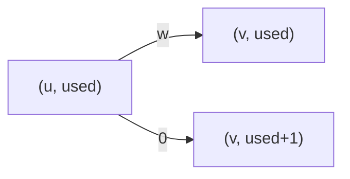

[[TOC]]

### 题意

给你一张无向带权图，从 `1` 走到 `N`。

你可以选择最多 `K` 条边，把它们“升级成高速路”，升级后的通过时间直接变成 `0`。

问最少需要多少时间到达终点。

### 思路

先看一个最直接的小数据暴力：

@include-code(./brute.cpp, cpp)

`brute.cpp` 会把“已经升级了多少条边”直接展开成分层图：

- 第 `0` 层：还没用过改造机会
- 第 `1` 层：已经用过 `1` 次
- ...
- 第 `K` 层：已经用过 `K` 次

如果原图里有一条边 `u <-> v`，那么就有两种走法：

1. 不改造这条边：
   - 留在当前层
   - 花费原边权
2. 改造这条边：
   - 跳到下一层
   - 花费 `0`

这个思路和 `P4822` 非常像，只是那里“用卡后边权减半”，这里则是“改造后边权直接变 0”。

#### 状态定义

设：

- `dist[u][used]` 表示到达点 `u`，并且已经使用了 `used` 次改造机会时的最短时间

那么沿一条边走到 `v` 时，有两种转移：

1. 正常走：
   - `(u, used) -> (v, used)`
   - 代价加 `w`
2. 如果 `used < K`，把这条边改成高速路：
   - `(u, used) -> (v, used+1)`
   - 代价加 `0`

这张图表示的就是这个转移：

图里每往下一层一次，就表示多消耗了一次改造机会。  
而留在本层，则表示这条边不改造，按原来的时间走。

因为所有边权都非负，所以直接在这个状态图上跑 Dijkstra 即可。

最后答案同样不是只看用了恰好 `K` 次，而是：

- `dist[N][0..K]` 的最小值

因为你没有义务把改造机会全部用完。

### 代码

@include-code(./main.cpp, cpp)

### 复杂度

状态数是：

- `N × (K + 1)`

每条原图边在每一层都会产生常数条转移，所以总复杂度大致为：

- `O(KM log (NK))`

在本题范围内完全可行。

空间复杂度：

- `O(NK)`

### 总结

这题和“卡片减半边权”那类题本质一样，区别只在转移代价。

一旦把“已经用了多少次特殊机会”写进状态里，问题就重新变回了标准的状态最短路。
