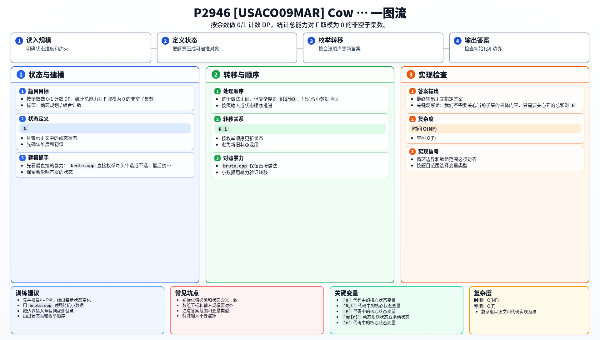

[[TOC]]

### 题意

有 `N` 头奶牛，每头奶牛有一个能力值 `R_i`。

要从这些奶牛里选出一个**非空子集**，让它们的能力和对 `F` 取模后等于 `0`。
题目要求输出这样的子集个数，并对 `10^8` 取模。

这张表把原题翻成了计数 DP：

| 原题对象 | 背包/DP 含义 |
| --- | --- |
| 一头奶牛 | 一个只能选一次的物品 |
| 当前和对 `F` 的余数 | 状态 |
| 选择或不选择 | 转移 |
| 满足 `sum % F == 0` | 目标状态 `0` |

### 思路

先看最直接的暴力：

@include-code(./brute.cpp, cpp)

`brute.cpp` 直接枚举每头牛选或不选，最后统计总和能被 `F` 整除的非空子集。

这个做法正确，但复杂度是 `O(2^N)`，只适合小数据验证。

关键观察是：我们不需要关心当前子集的具体内容，只需要关心它的总和对 `F` 的余数。

于是设：

- `dp[r]` 表示当前已经考虑若干头牛后，和对 `F` 取模为 `r` 的方案数

这张表说明状态定义：

| 状态 | 含义 |
| --- | --- |
| `dp[r]` | 当前子集和对 `F` 取模为 `r` 的方案数 |

初始时：

- `dp[0] = 1`

这表示空集的余数是 `0`。

处理一头能力值为 `x` 的牛时：

- 不选它：余数不变
- 选它：余数从 `r` 变成 `(r + x) % F`

因为每头牛只能选一次，所以要用上一轮的状态转移到下一轮状态。
实现时可以把旧数组拷贝到新数组里，再把“选这头牛一次”的贡献加进去。

最后 `dp[0]` 里包含了空集，所以答案要减去 `1`。

#### DP 公式

设 $dp_r$ 表示当前已经考虑若干头牛后，子集和对 $F$ 取模为 $r$ 的方案数。初始化：

$$
dp_0=1
$$

处理一头评分为 $a_i$ 的牛时，如果原余数为 $r$，选它后的新余数为：

$$
r'=(r+a_i)\bmod F
$$

转移为：

$$
next_{r'}\leftarrow next_{r'}+dp_r
$$

最终 $dp_0$ 包含空集，所以答案为：

$$
dp_0-1
$$

公式解释：状态只保留当前子集和模 `F` 的余数。选择一头牛会把余数从 `r` 推到 `(r+a_i) mod F`；最后余数为 `0` 的方案里包含空集，需要减一。

### 代码

@include-code(./main.cpp, cpp)

### 复杂度

- 时间复杂度：`O(NF)`
- 空间复杂度：`O(F)`

### 总结

这题本质上是一个“按余数做计数 DP”的问题：

- 只关心和对 `F` 的余数
- 每头牛只处理一次
- 最后从 `dp[0]` 里去掉空集

以后看到“选一些数，判断和能否被某个数整除，且每个元素最多选一次”这类题，就可以先想余数 DP。

### 一图流解析

这张图把本题的建模、关键转移、实现检查和训练方法压缩到一页，适合读完正文后复盘。

