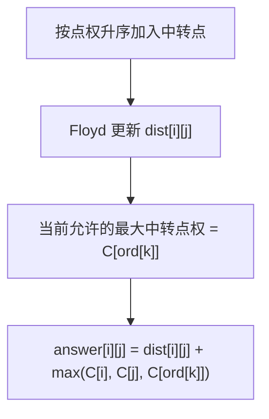

[[TOC]]

### 题意

有一张 `N` 个点的无向图，每条边有边权 `L`。  
每个点还有一个点权 `C`，表示这个牧场的过路费。

从 `s` 走到 `t` 的总费用不是单纯的路径边权和，而是：

1. 路径上所有边权之和
2. 再加上这条路径经过的所有点里，最大的那个过路费

给你很多组查询，要求回答每组 `(s,t)` 的最小总费用。

### 思路

先看一个更直接的小数据暴力：

@include-code(./brute.cpp, cpp)

`brute.cpp` 的想法很直观：

1. 对一条具体查询 `(s,t)`，在状态里额外记录“当前路径上最大点权是多少”
2. 用 Dijkstra 维护：
   - 走到某个点时的边权和
   - 同时知道当前最大点权
3. 最后取 `边权和 + 最大点权` 的最小值

这个写法完全贴着题意，但如果有很多询问，就要反复跑很多次最短路。

这题真正的关键，是把“最大点权”这件事和 Floyd 结合起来。

#### 关键观察

如果一条路径经过的所有中转点里，最大点权是 `X`，那么这条路径的总代价就是：

- `边权和最短值 + X`

也就是说，我们可以把问题拆成两部分：

1. 先控制“允许哪些点作为中转点”
2. 再在这个限制下求边权和最短路

最自然的做法是：

1. 把所有点按过路费 `C[i]` 从小到大排序
2. 依次把这些点加入 Floyd 的中转点集合
3. 当加入到第 `k` 个点时，说明：
   - 当前只允许过路费不超过 `C[ord[k]]` 的点做中转

这时 `dist[i][j]` 表示的就是：

- 中转点限制在这批点里时，`i -> j` 的最小边权和

于是答案就能更新成：

- `dist[i][j] + max(C[i], C[j], C[ord[k]])`

这张图展示的就是这个思路：

图里真正要看的，是“边权和”和“最大点权”被拆开处理了：  
Floyd 只负责维护边权和最短路；  
而当前这轮允许的最大中转点权，则由排序后的第 `k` 个点统一提供。

#### 为什么这样不会漏

任意一条最优路径，都有一个“路径上最大点权”。  
设这个值是 `X`，那么当我们枚举到所有点权 `<= X` 的点都已经允许做中转时：

- 这条路径就已经在 Floyd 的考虑范围里了
- 它对应的总代价也会在那一轮被算出来

所以把所有 `k` 都扫一遍，就不会漏掉真正的最优解。

### 代码

@include-code(./main.cpp, cpp)

### 复杂度

排序是：

- `O(N log N)`

主过程是一次 Floyd：

- `O(N^3)`

在每一轮 `k` 之后，我们还要顺手更新一次所有点对答案，这也是 `O(N^3)` 量级。

总复杂度：

- `O(N^3)`

空间复杂度：

- `O(N^2)`

### 总结

这题不是普通 Floyd，也不是普通点权最短路。

真正的核心是这个拆分：

1. Floyd 维护“边权和最短路”
2. 排序控制“当前路径允许的最大点权”

把“路径总代价 = 边权和 + 最大点权”拆开以后，这题就会变成一个很顺的排序 + Floyd 模型。
