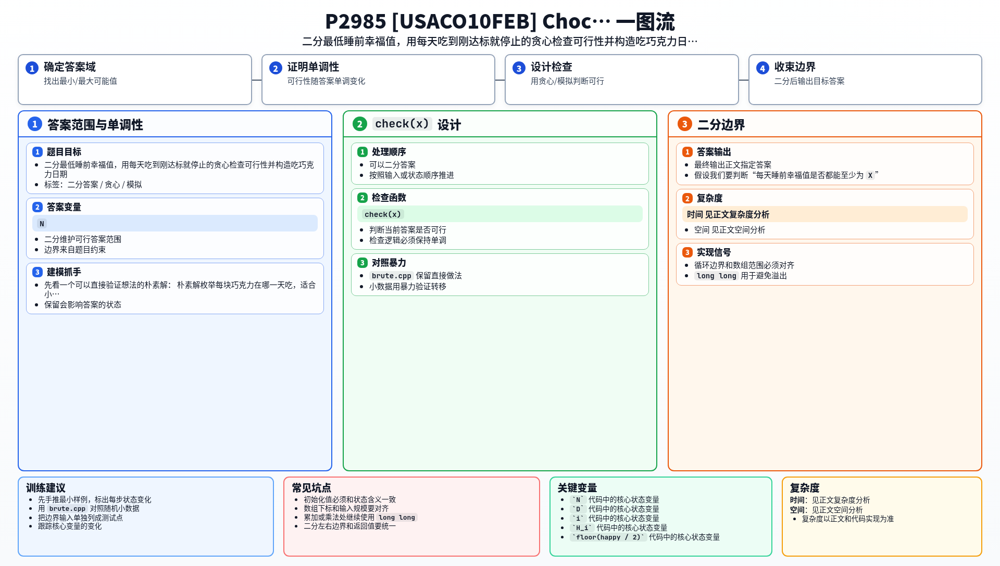

[[TOC]]

### 题意

有 `N` 块巧克力，要在 `D` 天内按顺序吃完。第 `i` 块巧克力会让幸福值增加 `H_i`。

每天睡前记录当天幸福值，然后睡觉时幸福值会变成 `floor(happy / 2)`。一天可以吃多块巧克力，也可以不吃，但巧克力必须按编号顺序吃。

要求最大化 `D` 天中睡前幸福值的最小值，并输出任意一种达到最优值的吃巧克力日期安排。

### 思路

先看一个可以直接验证想法的朴素解：

@include-code(./brute.cpp, cpp)

朴素解枚举每块巧克力在哪一天吃，适合小数据验证，但 `N,D` 都可达 `50000`，不能枚举方案。

这题可以二分答案。假设我们要判断“每天睡前幸福值是否都能至少为 `X`”。

检查 `X` 时，从第 1 天到第 `D` 天模拟：

1. 如果当前幸福值已经不少于 `X`，这天可以不吃巧克力。
2. 否则按顺序吃巧克力，直到幸福值第一次达到 `X`。
3. 如果巧克力吃完仍达不到 `X`，说明 `X` 不可行。
4. 当天结束后，睡觉使幸福值除以 `2` 向下取整。

为什么“第一次达到就停”是对的？因为固定目标 `X` 时，当天吃更多只会消耗后面的巧克力。刚达标就停，给后面留下最多资源。如果这种最省的吃法都失败，其他吃法也不会成功。

#### 样例中检查 `X=24`

这张表展示样例中目标最低幸福值为 `24` 时的一种检查过程。

| 天数 | 起床幸福值 | 当天吃掉的幸福值 | 睡前幸福值 |
| --- | --- | --- | --- |
| 1 | `0` | `10+40` | `50` |
| 2 | `25` | 不吃 | `25` |
| 3 | `12` | `13` | `25` |
| 4 | `12` | `22` | `34` |
| 5 | `17` | `7` | `24` |

每天睡前都至少是 `24`，所以 `24` 可行。继续二分可以证明更大的值不可行。

### 代码

@include-code(./main.cpp, cpp)

### 复杂度

每次检查最多扫描 `D` 天和 `N` 块巧克力，复杂度 `O(N+D)`。

- 总时间复杂度 `O((N+D) log sumH)`。
- 空间复杂度 `O(N)`。

### 总结

这题的关键是把“最大化最低值”转成二分答案。

给定一个最低幸福值后，贪心检查很自然：每天只吃到刚好达标为止。这个策略保留后续巧克力最多，所以能正确判断可行性；找到最大可行值后，再运行一次同样的过程就能构造输出方案。

### 一图流解析

这张图把本题的建模、关键转移、实现检查和训练方法压缩到一页，适合读完正文后复盘。

